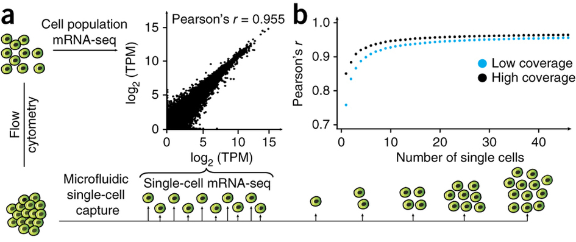

**Last updated:** `r Sys.Date()`

**Code version:** `r system("git log -1 --format='%H'", intern = TRUE)`

```{r chunk-options, include=FALSE}
source("chunk-options.R")
```

The mean counts per million in a subsampled set of single cells (both sequencing depth and number of cells is varied) is compared to the mean counts per million of the bulk cells (mean across the three batches).
The mean counts are log~2~ transformed with an added pseudocount of 1.

```{r message=FALSE}
library("dplyr")
library("ggplot2")
theme_set(theme_bw(base_size = 14))
```

## Batch process each subsampled data set

Run 10 iterations for each individual for each sequencing depth for each subsample of cells.
The analysis is performed by [correlate-single-to-bulk.R](https://github.com/jdblischak/singleCellSeq/blob/master/code/correlate-single-to-bulk.R).

```bash
cd $ssd/subsampled
mkdir -p correlation correlation-quantiles
mkdir -p ~/log/correlate-single-to-bulk.R
for IND in 19098 19101 19239
do
  for NUM in 200000 400000 600000 800000 1000000 1200000 1400000 1600000 1800000 2000000 2400000 2800000 3200000 3600000 4000000
  do
    for CELLS in 5 10 15 20 25 50 75 100 125 150
    do
      for SEED in {1..10}
      do
        # Correlation across all genes
        CMD="correlate-single-to-bulk.R $CELLS $SEED molecule-counts-$NUM.txt $ssc/data/reads.txt --individual=$IND --good_cells=/mnt/lustre/home/jdblischak/singleCellSeq/data/quality-single-cells.txt"
        DEST="correlation/$IND-$CELLS-$SEED-$NUM.txt"
        echo "$CMD > $DEST" | qsub -l h_vmem=2g -cwd -V -N cor-$IND-$CELLS-$SEED-$NUM -j y -o ~/log/correlate-single-to-bulk.R -l 'hostname=!bigmem01'
        sleep .01s
        # Correlation for genes separated by the specified quantiles
        CMD="correlate-single-to-bulk.R $CELLS $SEED molecule-counts-$NUM.txt $ssc/data/reads.txt --individual=$IND --good_cells=/mnt/lustre/home/jdblischak/singleCellSeq/data/quality-single-cells.txt -q .25 -q .5 -q .75"
        DEST="correlation-quantiles/$IND-$CELLS-$SEED-$NUM.txt"
        echo "$CMD > $DEST" | qsub -l h_vmem=2g -cwd -V -N cor-$IND-$CELLS-$SEED-$NUM-quantiles -j y -o ~/log/correlate-single-to-bulk.R -l 'hostname=!bigmem01'
        sleep .01s
      done
    done
  done
done
```

Convert to one file using Python.
Run from `$ssd/subsampled`.

```python
import os
import glob

def gather(files, outfile):
    out = open(outfile, "w")
    out.write("ind\tdepth\tnum_cells\tseed\tquantiles\tr\tnum_genes\n")
    for fname in files:
        fname_parts = os.path.basename(fname).rstrip(".txt").split("-")
        ind = fname_parts[0]
        depth = fname_parts[3]
        f = open(fname, "r")
        for line in f:
            out.write(ind + "\t" + depth + "\t" + line)
        f.close()
    out.close()

files = glob.glob("correlation/*txt")
gather(files, "correlation.txt")

files = glob.glob("correlation-quantiles/*txt")
gather(files, "correlation-quantiles.txt")
```

## Results

```{r input}
r_data <- read.table("/mnt/gluster/data/internal_supp/singleCellSeq/subsampled/correlation.txt",
                     header = TRUE, sep = "\t", stringsAsFactors = FALSE)
```

Calculate the mean and standard error of the mean (sem) for each of the 10 iterations.

```{r calculate-mean-and-sem}
r_data_plot <- r_data %>%
  group_by(ind, depth, num_cells) %>%
  summarize(mean = mean(r), sem = sd(r) / length(r))
```

```{r subsample-correlate-single-cell-to-bulk, fig.width=10, fig.height=10}
p <- ggplot(r_data_plot, aes(x = num_cells, y = mean, color = as.factor(depth))) +
  geom_line() +
  geom_errorbar(aes(ymin = mean - sem, ymax = mean + sem), width = 1) +
  facet_wrap(~ind) +
  labs(x = "Number of subsampled cells",
       y = "Pearson's r (mean +/- sem)",
       color = "Depth",
       title = "Subsample: Correlation of single and bulk cells")
p
```

Focus on the lower end of the distribution of the number of subsampled cells.

```{r subsample-correlate-single-cell-to-bulk-xlim, fig.width=10, fig.height=10, warning=FALSE}
p + xlim(0, 30)
```

## Pollen et al. 2014

[Pollen et al. 2014][Pollen2014] observed that the correlation between the average expression in a group of single cells and the expression in a bulk sample of 100 cells quickly saturates at about 10 single cells (Figure 2ab).
Each point is the mean of 10 subsamples.
The high coverage samples were sequenced at a depth of ~8.9 × 10^6^ reads per cell,
and the low coverage at ~2.7 × 10^5^ reads per cell.
The data comes from 46 K562 cells.



[Pollen2014]: http://www.ncbi.nlm.nih.gov/pmc/articles/PMC4191988/

## Results by expression quantiles

In the analysis above, all genes were used.
By default, the expression level in the bulk cells is used to remove the bottom 25% of genes from the analysis.
This basically removes genes that are clearly unexpressed.
Starting from this list of "expressed" genes, I split them into their expression quartiles.
Thus we can see how the correlation is affected by the expression level.

```{r input-quantiles}
r_q_data <- read.table("/mnt/gluster/data/internal_supp/singleCellSeq/subsampled/correlation-quantiles.txt",
                     header = TRUE, sep = "\t", stringsAsFactors = FALSE)
```

Calculate the mean and standard error of the mean (sem) for each of the 10 iterations.

```{r calculate-mean-and-sem-quantiles}
r_q_data_plot <- r_q_data %>%
  group_by(ind, depth, num_cells, quantiles) %>%
  summarize(mean = mean(r), sem = sd(r) / length(r), num_genes = num_genes[1])
```

Some single cells did not have enough reads for the higher subsamples.

```{r remove-na-quantiles}
r_q_data_plot <- na.omit(r_q_data_plot)
```

The full results.

```{r subsample-correlate-single-cell-to-bulk-quantiles, fig.width=10, fig.height=10}
p <- ggplot(r_q_data_plot, aes(x = num_cells, y = mean, color = as.factor(depth))) +
  geom_line() +
  geom_errorbar(aes(ymin = mean - sem, ymax = mean + sem), width = 1) +
  facet_grid(quantiles~ind) +
  labs(x = "Number of subsampled cells",
       y = "Pearson's r (mean +/- sem)",
       color = "Depth",
       title = "Subsample: Correlation of single and bulk cells")
p
```

Focus on one cell line, two sequencing depths, and the lower end of the number cells.

```{r subsample-correlate-single-cell-to-bulk-xlim-quantiles, fig.width=10, fig.height=10, warning=FALSE}
p %+% r_q_data_plot[r_q_data_plot$ind == 19098 &
                    r_q_data_plot$depth %in% c(2e5, 4e6), ] +
  xlim(0, 75)
```

## Session information

```{r info}
sessionInfo()
```
