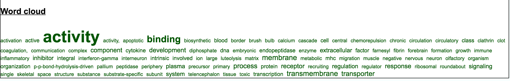

**Last updated:** `r Sys.Date()`

**Code version:** `r system("git log -1 --format='%H'", intern = TRUE)`

```{r chunk-options, include=FALSE}
source("chunk-options.R")

library(knitr)
opts_chunk$set(message = FALSE, warning = FALSE, eval = TRUE, 
               echo = TRUE)
```


## Background and some observations

Compare expression variability among the expressed cells between individuals. Here are our observations:

1. __CV-mean relationship__: This pattern in the expressed cells is different from the usual concave function we observe in bulk RNA-seq and scRNA-seq. Gene CVs increase as a function of gene abundance for genes with more than 50 percent of undetected cells; while, gene CVs decrease as a function of mean abundance, a pattern similar to previous studies for genes with 50 percent or less undetected cells.

2. __Overlaps of individual top mean and top CV genes__: Similar to when including non-expressed cells, there are few common top CV genes across individuals (~100 genes) and many more common top genes across individuals ( > 800 genes). This suggests possible individual differences in expression variablity. 

3. __Compare CV of the expressed cells__: We found 680 genes with differential variation across the expressed cell. 

4. __Compare mean abundance of the expressed cells__: Due to the large number of cells in each individual cell lines, more than 95% of the genes were found to have statistically significant differences between all three individuals. We identified differential expression genes between pairs of individuals under the conditions of q-value less than .01 in the test and also log2 fold change greater than 2: 5 genes in NA19098-NA19101, 6 in NA19098-NA19239, and 2 genes in NA19101-NA19239. *Note: The criterion for differential expression genes may be stringent, but the goal of this analysis is not to have a final say on the biological differences between the cell line, but rather to begin a conversatoin about the relationship between percent of undeteced cells and mean abundance*


## Set up

```{r, message=FALSE, warning=FALSE}
library(knitr)
library("limma")
library("ggplot2")
library("grid")
theme_set(theme_bw(base_size = 12))
source("functions.R")
library("Humanzee")
library("cowplot")
library("MASS")
library("matrixStats")
source("../code/cv-functions.r")
source("../code/plotting-functions.r")
library("mygene")
```


## Prepare data

We import molecule counts before standardizing and transformation and also log2-transformed counts after batch-correction. Biological variation analysis of the individuals is performed on the batch-corrected and log2-transformed counts. 


```{r import-data}
# Import filtered annotations
anno_filter <- read.table("../data/annotation-filter.txt", 
                      header = TRUE,
                      stringsAsFactors = FALSE)

# Import filtered molecule counts
molecules_filter <- read.table("../data/molecules-filter.txt",
                               header = TRUE, stringsAsFactors = FALSE)
stopifnot(NROW(anno_filter) == NCOL(molecules_filter))

# Import final processed molecule counts of endogeneous genes
molecules_final <- read.table("../data/molecules-final.txt", 
                             header = TRUE, stringsAsFactors = FALSE)
stopifnot(NROW(anno_filter) == NCOL(molecules_final))

# Import gene symbols
gene_symbols <- read.table(file = "../data/gene-info.txt", sep = "\t",
                           header = TRUE, stringsAsFactors = FALSE, quote = "")

# Import cell-cycle gene list
cell_cycle_genes <- read.table("../data/cellcyclegenes.txt",
                               header = TRUE, sep = "\t",
                               stringsAsFactors = FALSE)

# Import pluripotency gene list
pluripotency_genes <- read.table("../data/pluripotency-genes.txt",
                               header = TRUE, sep = "\t",
                               stringsAsFactors = FALSE)$To
```


Load CV results of all cells from [previous analysis][link]

[link]: http://jdblischak.github.io/singleCellSeq/analysis/cv-adjusted-summary-pois.html

```{r}
load("../data/cv-all-cells.rda")
```


## Compute gene mean and variance in the expressed cells

```{r}
file_name <- "../data/cv-expressed-cells.rda"
if (file.exists(file_name)) {
  load(file_name)
} else {
expressed_cv <- compute_expressed_cv(molecules_filter, 
                                     molecules_final, 
                                     anno_filter$individual)

expressed_dm <- normalize_cv_input(expressed_cv,
                                   anno_filter$individual)

save(expressed_cv, expressed_dm, file = file_name)
}
```


Filter data to only include genes with valid CV measures when including the 
expressed cells.

```{r match-genes}
# get gene names from the cv data of the expessed cells
valid_genes_cv_expressed <- rownames(expressed_cv[[1]])

# make subset data for later analysis involving expressed cells
molecules_filter_subset <- molecules_filter[
  which(rownames(molecules_filter) %in% valid_genes_cv_expressed), ]

molecules_final_subset <- molecules_final[
  which(rownames(molecules_final) %in% valid_genes_cv_expressed), ]

ENSG_cv_subset <- lapply(ENSG_cv, function(x) {
  x[which(rownames(x) %in% valid_genes_cv_expressed), ]      
})
names(ENSG_cv_subset) <- names(ENSG_cv)  

ENSG_cv_adj_subset <- lapply(ENSG_cv_adj, function(x) {
  x[which(rownames(x) %in% valid_genes_cv_expressed), ]      
})
names(ENSG_cv_adj_subset) <- names(ENSG_cv_adj) 
```


Compute a matrix of 0's and 1's indicating non-detected and detected cells, respectively.

```{r}
molecules_expressed_subset <- molecules_filter_subset
molecules_expressed_subset[which(molecules_filter_subset > 0 , arr.ind = TRUE)] <- 1
molecules_expressed_subset <- as.matrix((molecules_expressed_subset))

# make a batch-corrected data set in which the non-detected cells are 
# code as NA
molecules_final_expressed_subset <- molecules_final_subset
molecules_final_expressed_subset[which(molecules_filter_subset == 0, arr.ind= TRUE)] <- NA
```


## CV-mean plots


```{r}
theme_set(theme_bw(base_size = 8))
cowplot::plot_grid(
    plot_poisson_cv_expressed(
          expr_mean = expressed_cv$all$expr_mean, 
          exprs_cv = expressed_cv$all$expr_cv, 
          ylab = "Coefficient of variation (CV)", 
          main = "All individauls, expressed cells") +
          theme(legend.position = "none"),
    plot_poisson_cv_expressed(
          expr_mean = expressed_cv$NA19098$expr_mean, 
          exprs_cv = expressed_cv$NA19098$expr_cv, 
          ylab = "Coefficient of variation (CV)", 
          main = "NA19098 expressed cells") +
          theme(legend.position = "none"),
    plot_poisson_cv_expressed(
          expr_mean = expressed_cv$NA19101$expr_mean, 
          exprs_cv = expressed_cv$NA19101$expr_cv, 
          ylab = "Coefficient of variation (CV)", 
          main = "NA19101 expressed cells") +
          theme(legend.position = "none"),
    plot_poisson_cv_expressed(
          expr_mean = expressed_cv$NA19239$expr_mean, 
          exprs_cv = expressed_cv$NA19239$expr_cv, 
          ylab = "Coefficient of variation (CV)", 
          main = "NA19239 expressed cells") +
          theme(legend.position = "none"),
  ncol = 2,
  labels = LETTERS[1:4])
```


CV all cells vs. expressed cells


```{r}
require(matrixStats)

xlabs <- "CV of all cells"
ylabs <- "CV of expressed cells"
plot_title <- names(expressed_cv)
par(mfrow = c(2,2))
# plot(x = ENSG_cv_subset$all$cv,
#      y = expressed_cv$all$expr_cv)
for (ind in names(expressed_cv)[1:3]) {
  which_ind <- which(names(ENSG_cv_subset) %in% ind)
  plot(x = ENSG_cv_subset[[ind]]$cv,
       y = expressed_cv[[ind]]$expr_cv, 
       cex = .7, pch = 16, col = scales::alpha("grey20", .7),
       xlab = xlabs,
       ylab = ylabs,
       main = plot_title[which_ind])
}
title("CV before adjustment")
```


DM values are orthogonal between individuals.

```{r}
par(mfrow = c(2,2))
for (i in 1:2) {
  for (j in (i+1):3) {
    plot(expressed_cv[[i]]$expr_cv,
         expressed_cv[[j]]$expr_cv,
         xlab = names(expressed_cv)[i],
         ylab = names(expressed_cv)[j],
          cex = .7, pch = 16, col = scales::alpha("grey20", .7))
  }
}
title(main = "Between individual CVs",
      outer = TRUE, line = -1)


par(mfrow = c(2,2))
for (i in 1:2) {
  for (j in (i+1):3) {
    plot(expressed_dm[[i]],
         expressed_dm[[j]],
         xlab = names(expressed_cv)[i],
         ylab = names(expressed_cv)[j],
          cex = .7, pch = 16, col = scales::alpha("grey20", .7))
  }
}
title(main = "Between individual adjusted CVs",
      outer = TRUE, line = -1)
```


## Extreme CV genes - top 1000

CV before correction

```{r, fig.width=8, fig.height=4}
library(VennDiagram)
library(gridExtra)
genes <- rownames(molecules_final_subset)
overlap_list_expressed <- list(
   NA19098 = genes[ which( rank(expressed_cv$NA19098$expr_cv) 
                               > length(genes) - 1000 ) ],
   NA19101 = genes[ which( rank(expressed_cv$NA19101$expr_cv) 
                               > length(genes) - 1000 ) ],
   NA19239 = genes[ which( rank(expressed_cv$NA19239$expr_cv) 
                               > length(genes) - 1000 ) ] )  

overlap_list_all <- list(
   NA19098 = genes[ which( rank(ENSG_cv_subset$NA19098$cv) 
                               > length(genes) - 1000 ) ],
   NA19101 = genes[ which( rank(ENSG_cv_subset$NA19101$cv)
                           > length(genes) - 1000 ) ],
   NA19239 = genes[ which( rank(ENSG_cv_subset$NA19239$cv)
                           > length(genes) - 1000 ) ] ) 

grid.arrange(gTree(children = venn.diagram(overlap_list_all,filename = NULL,
                          category.names = names(overlap_list_all),
                          name = "All cells")),
             gTree(children = venn.diagram(overlap_list_expressed,filename = NULL,
                          category.names = names(overlap_list_expressed),
                          name = "Expressed cells")),
             ncol = 2)
```


CV after correction

```{r, fig.width=8, fig.height=4}
genes <- rownames(molecules_final_subset)
overlap_list_expressed <- list(
   NA19098 = genes[ which( rank(expressed_dm$NA19098) 
                               > length(genes) - 1000 ) ],
   NA19101 = genes[ which( rank(expressed_dm$NA19101) 
                               > length(genes) - 1000 ) ],
   NA19239 = genes[ which( rank(expressed_dm$NA19239) 
                               > length(genes) - 1000 ) ] )  

overlap_list_all <- list(
   NA19098 = genes[ which( rank(ENSG_cv_adj_subset$NA19098$log10cv2_adj) 
                               > length(genes) - 1000 ) ],
   NA19101 = genes[ which( rank(ENSG_cv_adj_subset$NA19101$log10cv2_adj)
                           > length(genes) - 1000 ) ],
   NA19239 = genes[ which( rank(ENSG_cv_adj_subset$NA19239$log10cv2_adj)
                           > length(genes) - 1000 ) ] ) 

grid.arrange(gTree(children = venn.diagram(overlap_list_all,filename = NULL,
                          category.names = names(overlap_list_all),
                          name = "All cells")),
             gTree(children = venn.diagram(overlap_list_expressed,filename = NULL,
                          category.names = names(overlap_list_expressed),
                          name = "Expressed cells")),
             ncol = 2)
```


Mean and CV

```{r, fig.width=8, fig.height=4}
genes <- rownames(molecules_final_subset)
overlap_list_expressed <- list(
   NA19098 = genes[ which( rank(expressed_dm$NA19098) 
                               > length(genes) - 1000 ) ],
   NA19101 = genes[ which( rank(expressed_dm$NA19101) 
                               > length(genes) - 1000 ) ],
   NA19239 = genes[ which( rank(expressed_dm$NA19239) 
                               > length(genes) - 1000 ) ] )  

overlap_list_mn <- list(
   NA19098 = genes[ which( rank(expressed_cv$NA19098$expr_mean) 
                               > length(genes) - 1000 ) ],
   NA19101 = genes[ which( rank(expressed_cv$NA19101$expr_mean) 
                           > length(genes) - 1000 ) ],
   NA19239 = genes[ which( rank(expressed_cv$NA19239$expr_mean) 
                           > length(genes) - 1000 ) ] ) 

grid.arrange(gTree(children = venn.diagram(overlap_list_expressed,filename = NULL,
                          category.names = names(overlap_list_expressed),
                          name = "Adjusted CV")),
             gTree(children = venn.diagram(overlap_list_mn,filename = NULL,
                          category.names = names(overlap_list_mn),
                          name = "Abundance")),
             ncol = 2)
```


## Differential testing of adjusted CV - permutation

Permutation analysis was done on midway. The following objects were exported to midway for the analysis.

*[chunk not evaluated]*
```{r, eval = FALSE}
library(matrixStats)
mad_expressed <- rowMedians( abs( as.matrix(expressed_dm) - rowMedians(as.matrix(expressed_dm)) ) )


save(
  mad_expressed,
  anno_filter,
  molecules_final_df,
  molecules_expressed_df, 
  file = "rda/cv-adjusted-summary-pois-expressed/rda-for-midway-expressed-cells.rda")
```

Compute dissimilarity between individual adjusted CV for each gene.

The following batch script runs `permute-cv-test-expressed.r`.

*[chunk not evaluated]*

```
sbatch permute-cv-test-expressed.sbatch
```


Compute empirical p-values. 

The following batch script runs `permute-cv-compute-pval-expressed.r`.

*[chunk not evaluated]*

```
sbatch permute-cv-compute-pval-expressed.sbatch
```


Load results.

```{r}
load("../data/permuted-pval-expressed.rda")

permuted_pval$mad_pval_rev <- permuted_pval$mad_pval
permuted_pval$mad_pval_rev[permuted_pval$mad_pval == 0] <- 1/length(permuted_pval$mad_pval)
```


```{r}
par(mfrow = c(1,1))
hist(permuted_pval$mad_pval_rev,
     main = "Diff. in the expressed cells",
     xlab = "permtued p-values")
```


Pluripotency genes

```{r}
sig_genes <- rownames(permuted_pval)[which(permuted_pval$mad_pval == 0)]
sig_genes[which(sig_genes %in% pluripotency_genes)]
gene_symbols[which(gene_symbols$ensembl_gene_id %in% sig_genes[which(sig_genes %in% pluripotency_genes)]), ]
```

```{r include= F}
write.table(sig_genes,
           file = "../data/sig-expressed-genes.txt",
           sep = "\t", quote = FALSE,
           col.names = FALSE, row.names = FALSE)
```


## Enrichment analysis of differential CV genes

I used CPDB go perform enrichment analysis. The enriched GO term are represented in WordCloud as follows.





```{r}
go_top <- read.table("figure/cv-adjusted-summary-pois-expressed.Rmd/go-expressed-sig.tab",
                       sep = "\t",
                       header = TRUE)
go_top <- go_top[go_top$q.value < .1, ]
as.character(go_top$term_name)

library(mygene)
go_top_genes <- getGenes(gsub(";", ",",
                    as.character(go_top$members_input_overlap_geneids)))
go_top_genes <- go_top_genes[!duplicated(go_top_genes[ , "symbol"]), ]
kable(data.frame(symbol = go_top_genes[ ,"symbol"],
                 name = go_top_genes[,"name"]) )

```


## Differential testing of gene abundance

We would like to compare abundance levels using the expression data that were already log-transformed, standardized, and batch-corrected. 


```{r, fig.width=7, fig.height=3.5}
# MA plot
par(mfrow = c(1,2))
plot(y = rowMeans(molecules_final_expressed_subset[,
                   anno_filter$individual == "NA19098"], na.rm = TRUE) -
         rowMeans(molecules_final_expressed_subset[,
                   anno_filter$individual == "NA19101"], na.rm = TRUE),
     x = rowMeans(molecules_final_expressed_subset[,
                   anno_filter$individual != "NA19239"], na.rm = TRUE),
     xlab = "Avg. log2 agene expression",
     ylab = "log2 NA19098 - log2 NA19101",
     main = "MA-plot: NA19098 vs. NA19101",
     pch = 16, cex = 0.25)
abline(h = 0, col = "red")


# make a voom plot straight from our corrected counts
fit <- limma::lmFit(as.matrix(molecules_final_expressed_subset),
                     design = model.matrix(~ anno_filter$individual + 
                                     anno_filter$replicate + 0) )
sx <- fit$Amean 
sy <- sqrt(fit$sigma)
allzero <- rowSums(as.matrix(molecules_final_expressed_subset), na.rm = TRUE) == 0
if (any(allzero)) {
  sx <- sx[!allzero]
  sy <- sy[!allzero]
}
l <- lowess(sx, sy, f = .5)
plot(sx, sy, xlab = "log2 gene expression", 
     ylab = "Sqrt( standard deviation )", 
     pch = 16, cex = 0.25)
title("voom: Mean-variance trend")
lines(l, col = "red")
```


Fit a linear model to each gene, compute voom weights to account for CV as a convex function of gene abundance.


```{r}
file_name <- "../data/sig-mean-expressed.rda"
if (file.exists(file_name)) {
  load(file_name)  
} else {
  # make a voom plot straight from our corrected counts
  fit <- limma::lmFit(as.matrix(molecules_final_expressed_subset),
                       design = model.matrix(~ anno_filter$individual +
                                       anno_filter$replicate + 0) )
  sx <- fit$Amean 
  sy <- sqrt(fit$sigma)
  allzero <- rowSums(as.matrix(molecules_final_expressed_subset), na.rm = TRUE) == 0
  if (any(allzero)) {
    sx <- sx[!allzero]
    sy <- sy[!allzero]
  }
  l <- lowess(sx, sy, f = .5)
  # compute voom weights
  f <- approxfun(l, rule = 2)
  fitted.values <- fit$coef %*% t(fit$design)
  fitted.logcount <- fitted.values
  w <- 1/f(fitted.logcount)^4
  dim(w) <- dim(fitted.logcount)
  
  # differential testing of mean abundance
  design <-  model.matrix( ~ individual + replicate + 0,
                 data = data.frame(individual = factor(anno_filter$individual),
                                   replicate = factor(anno_filter$replicate)) )
  fit_w <- lmFit(as.matrix(molecules_final_expressed_subset),
                  design = design, weights = w)
  cont.matrix <- makeContrasts(
    NA19098_NA19101 = "individualNA19098 - individualNA19101",
    NA19098_NA19239 = "individualNA19098 - individualNA19239",
    NA19101_NA19239 = "individualNA19101 - individualNA19239",
    levels = design)
  fit_w <- contrasts.fit(fit_w, cont.matrix)
  fit_w <- eBayes(fit_w)
  
  save(fit_w, file = file_name)
}

colnames(fit_w)
names(fit_w)
par(mfrow = c(2,2))
for (i in 1:3) {
  hist(fit_w$p.value[,i],
       main = colnames(fit_w$p.value)[i],
       xlab = "p-value")
  mtext(side = 3, text = paste(sum(p.adjust(fit_w$p.value[,i], method = "fdr") < .01, na.rm = TRUE), "sig. genes (q <.01)"))
}
title(main = "Differential expression p-value",
      outer = TRUE, line = -1)
```


Genes with large sig. difference and fold change more than 2.

```{r}
log2fc <- data.frame(
  NA19098_NA19101 = rowMeans(molecules_final_expressed_subset[,anno_filter$individual == "NA19098"], na.rm = TRUE) - rowMeans(molecules_final_expressed_subset[,anno_filter$individual == "NA19101"], na.rm = TRUE),
  NA19098_NA19239 = rowMeans(molecules_final_expressed_subset[,anno_filter$individual == "NA19098"], na.rm = TRUE) - rowMeans(molecules_final_expressed_subset[,anno_filter$individual == "NA19239"], na.rm = TRUE),
  NA19101_NA19239 = rowMeans(molecules_final_expressed_subset[,anno_filter$individual == "NA19101"], na.rm = TRUE) - rowMeans(molecules_final_expressed_subset[,anno_filter$individual == "NA19239"], na.rm = TRUE) )
```


Density plots

```{r}
print(colnames(fit_w)[1])
gene_elect <- rownames(fit_w)[which(p.adjust(fit_w$p.value[,1], method = "fdr") < .01 & abs(log2fc$NA19098_NA19101) < 1)]

par(mfrow = c(3,2))
for (i in 1:6) {
  plot_density_overlay(
    molecules = molecules_final_expressed_subset,
    annotation = anno_filter,
    which_gene = gene_elect[i], 
    labels = "",
    xlims = c(1,14), ylims = NULL,
    gene_symbols = gene_symbols)
}
title(main = "NA19098_NA19101", outer = TRUE, line = -1)

library(mygene)
kable(getGenes(gene_elect, 
         fields = c("symbol", "name", "summary")))
```


## Others

```{r, eval = FALSE, echo = FALSE, include = F}
# output some results
# print out distributions 
# TBD (too many genes, choose some...)
gene_subset <- which(rownames(molecules_final_expressed_subset) %in%
                       rownames(permuted_pval))
gene_subset2 <- which(rownames(permuted_pval) %in%
                       rownames(molecules_final_expressed_subset))
all.equal(rownames(molecules_final_expressed_subset[gene_subset, ]),
          rownames(permuted_pval[gene_subset2, ]))

par(mfrow = c(1,1))
gene_mn <- rowMeans(molecules_final_expressed_subset[gene_subset, ])
plot(y = -log10(permuted_pval[gene_subset2, ]$mad_pval_rev),
     x = gene_mn)


genes_elect <- rownames(expressed_dm)[
                 which(rank(mad_expressed) > length(mad_expressed) - 100)]
#gene_ind <- which(rownames(ENSG_cv[[ind]]) %in% rownames(expressed_cv[[ind]]))
pdf("figure/cv-adjusted-summary-pois-expressed.Rmd/density-high-mad-expressed.pdf",
    height = 12, width =8)
par(mfrow = c(5,4))
for (i in 1:length(genes_elect)) {
  plot_density_overlay(
  molecules = molecules_final_df*molecules_expressed_df,
  annotation = anno_filter,
  individual_label = NULL,
  which_gene = genes_elect[i], 
  labels = "",
  xlims = c(1,14), ylims = NULL,
  gene_symbols = gene_symbols)
plot_density_overlay(
  molecules = molecules_final_df,
  annotation = anno_filter,
  individual_label = NULL,
  which_gene = genes_elect[i], 
  labels = "",
  xlims = c(1,14), ylims = NULL,
  gene_symbols = gene_symbols)
}
dev.off()
```


## Session information

```{r info}
sessionInfo()
```
