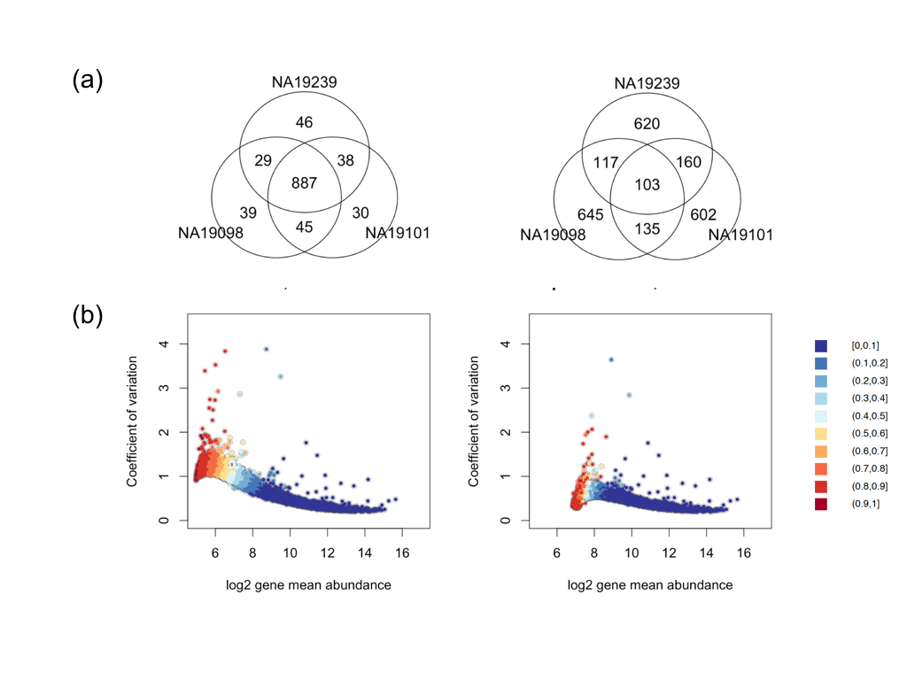
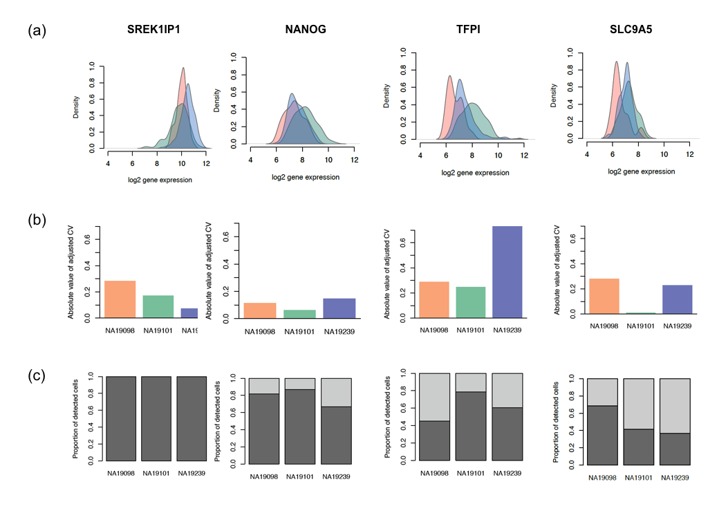

**Last updated:** `r Sys.Date()`

**Code version:** `r system("git log -1 --format='%H'", intern = TRUE)`

```{r chunk-options, include=FALSE}
source("chunk-options.R")

library(knitr)
opts_chunk$set(message = FALSE, warning = FALSE, eval = TRUE, 
               echo = TRUE)
```


## Objective

This page documents analysis performed for the paper figures. 


## Set up

```{r, message=FALSE, warning=FALSE}
library("data.table")
library("dplyr")
library("limma")
library("edgeR")
library("ggplot2")
library("grid")
theme_set(theme_bw(base_size = 12))
source("functions.R")
library("Humanzee")
library("cowplot")
library("MASS")
library("matrixStats")
source("../code/plotting-functions.R")
```


We import molecule counts before standardizing and transformation and also log2-transformed counts after batch-correction. Biological variation analysis of the individuals is performed on the batch-corrected and log2-transformed counts. 


```{r import-data}
# Import filtered annotations
anno_filter <- read.table("../data/annotation-filter.txt", 
                      header = TRUE,
                      stringsAsFactors = FALSE)

# Import filtered molecule counts
molecules_filter <- read.table("../data/molecules-filter.txt",
                               header = TRUE, stringsAsFactors = FALSE)
stopifnot(NROW(anno_filter) == NCOL(molecules_filter))

# Import final processed molecule counts of endogeneous genes
molecules_final <- read.table("../data/molecules-final.txt", 
                             header = TRUE, stringsAsFactors = FALSE)
stopifnot(NROW(anno_filter) == NCOL(molecules_final))

# Import gene symbols
gene_symbols <- read.table(file = "../data/gene-info.txt", sep = "\t",
                           header = TRUE, stringsAsFactors = FALSE, quote = "")

# Import cell-cycle gene list
cell_cycle_genes <- read.table("../data/cellcyclegenes.txt",
                               header = TRUE, sep = "\t",
                               stringsAsFactors = FALSE)

# Import pluripotency gene list

pluripotency_genes <- read.table("../data/pluripotency-genes.txt",
                               header = TRUE, sep = "\t",
                               stringsAsFactors = FALSE)$To
```


Load gene CVs computed over all cells ([link1][link1]) and CV computed only over the expressed cells ([link2][link2]).


[link1]: http://jdblischak.github.io/singleCellSeq/analysis/cv-adjusted-summary-pois.html
[link2]: http://jdblischak.github.io/singleCellSeq/analysis/cv-adjusted-summary-pois-expressed.html

```{r}
load("../data/cv-all-cells.rda")
load("../data/cv-expressed-cells.rda")
#load("../data/sig-mean-expressed.rda")

## permutation results including the detected/expressed cells
load("../data/permuted-pval-expressed-set1.rda")

## load observed statistics (MAD)
load("../data/mad-expressed.rda")
```


Compute a matrix of 0's and 1's labeling non-detected and detected cells, respectively.

```{r}
molecules_expressed <- molecules_filter
molecules_expressed[which(molecules_filter > 0 , arr.ind = TRUE)] <- 1
molecules_expressed <- as.matrix((molecules_expressed))
```


Take the gene subset included in the final data.

```{r}
genes_included <- Reduce(intersect,
                         list(rownames(molecules_final),
                             rownames(expressed_cv$NA19098),
                             names(perm_pval_set1)) )

molecules_filter_subset <- molecules_filter[
  which(rownames(molecules_filter) %in% genes_included), ]

molecules_final_subset <- molecules_final[
  which(rownames(molecules_final) %in% genes_included), ]

molecules_expressed_subset <- molecules_expressed[
  which(rownames(molecules_expressed) %in% genes_included), ]

molecules_final_expressed_subset <- molecules_final_subset*molecules_expressed_subset
molecules_final_expressed_subset[which(molecules_expressed_subset == 0, arr.ind = TRUE)] <- NA

permuted_pval_subset <- perm_pval_set1[which(names(perm_pval_set1) %in% genes_included)]

expressed_cv_subset <- lapply(expressed_cv, function(x)
  x[which(rownames(x) %in% genes_included), ] )
names(expressed_cv_subset) <- names(expressed_cv)

expressed_dm_subset <- expressed_dm[which(rownames(expressed_dm) %in% genes_included), , ] 

dim(molecules_final_subset)
dim(molecules_expressed_subset)
all.equal(rownames(expressed_cv_subset$NA19098), 
          rownames(molecules_final_expressed_subset) )
all.equal(names(permuted_pval_subset), 
          rownames(molecules_expressed_subset) )
```


Compute drop-out rates.

```{r compute-dropout}
drop_out <- lapply(unique(anno_filter$individual), function(ind) {
  temp_df <- molecules_filter_subset[,anno_filter$individual == ind]
  zero_count <- rowMeans(temp_df == 0)
  return(zero_count)
})  
names(drop_out) <- unique(anno_filter$individual)
drop_out$all <- rowMeans(as.matrix(molecules_filter_subset) == 0)


summary(drop_out$NA19098)
summary(drop_out$NA19101)
summary(drop_out$NA19239)
summary(drop_out$all)
```


Statistical test for individual difference in dropout rate: logistic regression

```{r}
if(!file.exists("../data/sig-dropout.rda")) {
library(lmtest)
  drop_out_significance <- sapply(1:NROW(molecules_expressed_subset), function(i) {
  fit <- glm(molecules_expressed_subset[i,] ~ as.factor(anno_filter$individual),
             family = "binomial")
  lrtest(fit)$P[2]  
})
  save(drop_out_significance, file = "../data/sig-dropout.rda")
} else {
  load("../data/sig-dropout.rda")
}
quantile(drop_out_significance, prob = seq(0,1,.1))[2] < 1e-5
sum(drop_out_significance < quantile(drop_out_significance, prob = seq(0,1,.1))[2])
```


## Main figure 1



```{r venn, eval = F}
# Venn diagrams
# only expressed cells
library(gplots)
genes <- rownames(expressed_cv_subset[[1]])
venn_mean_rank <- gplots::venn( 
  list(NA19098 = genes[ which(rank(expressed_cv_subset[[1]]$expr_mean) > length(genes) - 1000 ) ],
       NA19101 = genes[ which(rank(expressed_cv_subset[[2]]$expr_mean) > length(genes) - 1000 ) ],
       NA19239 = genes[ which(rank(expressed_cv_subset[[3]]$expr_mean) > length(genes) - 1000 ) ] ) )

venn_cv_rank <- gplots::venn( 
  list(NA19098 = genes[ which(rank(expressed_cv_subset[[1]]$expr_cv) > length(genes) - 1000 ) ],
       NA19101 = genes[ which(rank(expressed_cv_subset[[2]]$expr_cv) > length(genes) - 1000 ) ],
       NA19239 = genes[ which(rank(expressed_cv_subset[[3]]$expr_cv) > length(genes) - 1000 ) ] ) )


# cv and mean of batch-corrected data including all cells
# across all three indivivduals
par(mfrow = c(1,2))
all_cv <- matrixStats::rowSds(2^molecules_final_subset)/rowMeans(2^molecules_final_subset)
all_mn <- rowMeans(2^molecules_final_subset)
plot(y = all_cv,
     x = log2(all_mn),
     cex = .9, col = alpha("grey40", .8), lwd = .6,
     xlab = "log2 gene mean abundance",
     ylab = "Coefficient of variation",
     main = "All cells, all indviduals",
     xlim = c(5,17), ylim = c(0,4.5))
points(y = all_cv,
       x = log2(all_mn), 
       col = rev(RColorBrewer::brewer.pal(10, "RdYlBu"))[
                cut(drop_out$all, breaks = seq(0, 1, by = .1),
                     include.lowest = TRUE)], 
       cex = .6, pch = 16)

# cv and mean of batch-corrected data including only expressed cells
# across all three indivivduals
plot(y = expressed_cv_subset$all$expr_cv,
     x = log2(expressed_cv_subset$all$expr_mean),
     cex = .9, col = alpha("grey40", .8), lwd = .6,
     xlab = "log2 gene mean abundance",
     ylab = "Coefficient of variation",
     main = "Expressed cells, all individuals",
     xlim = c(5,17), ylim = c(0,4.5))
points(y = expressed_cv_subset$all$expr_cv,
       x = log2(expressed_cv_subset$all$expr_mean), 
       col = rev(RColorBrewer::brewer.pal(10, "RdYlBu"))[
                cut(drop_out$all, breaks = seq(0, 1, by = .1),
                     include.lowest = TRUE)], 
       cex = .6, pch = 16)

# make labels
plot(x = rep(1,10), y = 1:10, 
     pch = 15, cex = 2, axes = F, xlab = "", ylab = "",
     col = (RColorBrewer::brewer.pal(10, "RdYlBu")), xlim = c(0, 13))
text(labels = rev( levels(cut(drop_out$NA19098, breaks = seq(0, 1, by = .1),
                     include.lowest = TRUE))) ,
     y = 1:10, x = 3, cex = .7, adj = 0)
title(main = "drop-out rate")
```

```{r venn-plots, fig.width=8, fig.height=4}
library(VennDiagram)
library(gridExtra)
## venn diagrams of expressed cells
genes <- rownames(expressed_cv_subset[[1]])

## create list of top 1000 mean
venn_mean_expressed <- list(
   NA19098 = genes[ which(rank(expressed_cv_subset[[1]]$expr_mean) > length(genes) - 1000 ) ],
   NA19101 = genes[ which(rank(expressed_cv_subset[[2]]$expr_mean) > length(genes) - 1000 ) ],
   NA19239 = genes[ which(rank(expressed_cv_subset[[3]]$expr_mean) > length(genes) - 1000 ) ] )  

## create list of top 1000 CV
venn_cv_expressed <- list( 
   NA19098 = genes[ which(rank(expressed_cv_subset[[1]]$expr_cv) > length(genes) - 1000 ) ],
   NA19101 = genes[ which(rank(expressed_cv_subset[[2]]$expr_cv) > length(genes) - 1000 ) ],
   NA19239 = genes[ which(rank(expressed_cv_subset[[3]]$expr_cv) > length(genes) - 1000 ) ] ) 

## put the two venn diagrams together
grid.arrange(gTree(children = venn.diagram(venn_mean_expressed,filename = NULL,
                          category.names = names(venn_mean_expressed),
                          name = "Top 1000 mean")),
             gTree(children = venn.diagram(venn_cv_expressed,filename = NULL,
                          category.names = names(venn_cv_expressed),
                          name = "Top 1000 CV")),
             ncol = 2)
```

```{r venn-expressed, fig.width = 5, fig.height=5}
genes <- rownames(expressed_cv_subset[[1]])
venn_mean_rank <- gplots::venn( 
  list(NA19098 = genes[ which(rank(expressed_cv_subset[[1]]$expr_mean) > length(genes) - 1000 ) ],
       NA19101 = genes[ which(rank(expressed_cv_subset[[2]]$expr_mean) > length(genes) - 1000 ) ],
       NA19239 = genes[ which(rank(expressed_cv_subset[[3]]$expr_mean) > length(genes) - 1000 ) ] ) )

venn_cv_rank <- gplots::venn( 
  list(NA19098 = genes[ which(rank(expressed_cv_subset[[1]]$expr_cv) > length(genes) - 1000 ) ],
       NA19101 = genes[ which(rank(expressed_cv_subset[[2]]$expr_cv) > length(genes) - 1000 ) ],
       NA19239 = genes[ which(rank(expressed_cv_subset[[3]]$expr_cv) > length(genes) - 1000 ) ] ) )
```


venn diagram of gene-specific mean and adjusted CV for when all cells are included

For more results for when including all cells, see [here][results-all-cells]. 

[results-all-cells]: http://jdblischak.github.io/singleCellSeq/analysis/cv-adjusted-summary-pois.html

```{r venn-all, fig.width = 5, fig.height=5}
load("../data/cv-all-cells.rda")
genes <- rownames(ENSG_cv[[1]])
library(gplots)
venn_cv_rank <- gplots::venn(
  list(NA19098 = genes[ which( rank(ENSG_cv_adj$NA19098$log10cv2_adj) 
                               > length(genes) - 1000 ) ],
       NA19101 = genes[ which( rank(ENSG_cv_adj$NA19101$log10cv2_adj) 
                               > length(genes) - 1000 ) ],
       NA19239 = genes[ which( rank(ENSG_cv_adj$NA19239$log10cv2_adj) 
                               > length(genes) - 1000 ) ] ))

gplots::venn( 
  list(NA19098 = genes[ which(rank(ENSG_cv[[1]]$mean) > length(genes) - 1000 ) ],
       NA19101 = genes[ which(rank(ENSG_cv[[2]]$mean) > length(genes) - 1000 ) ],
       NA19239 = genes[ which(rank(ENSG_cv[[3]]$mean) > length(genes) - 1000 ) ] ) )
```


## Supplemental Figure 6




*[chunk not evaluated]*
```{r bio-figure2, eval = F}
par(mfrow = c(1,1))
hist(drop_out$all, xlim = c(0,1))

#NANOG: a key pluripotency gene.
#All the other genes had significant difference between adjusted CV of the expressed cells.

query_genes <- c("NANOG", "TFPI", "SLC9A5", "SLC25A16", "SREK1IP1")
query_genes_ensg <- gene_symbols[which(gene_symbols$external_gene_name %in% query_genes), ]

## print permuted p-values of the chosen genes
pvals_tab <- rbind(names(perm_pval_set1)[which(names(perm_pval_set1) %in% query_genes_ensg$ensembl_gene_id)],
      gene_symbols$external_gene_name[gene_symbols$ensembl_gene_id %in% names(perm_pval_set1)[which(names(perm_pval_set1) %in% query_genes_ensg$ensembl_gene_id)]],
      perm_pval_set1[which(names(perm_pval_set1) %in% query_genes_ensg$ensembl_gene_id)] )
      
pdf("figure/cv-adjusted-summary-pois-final.Rmd/chosen-genes.pdf",
    height = 8, width = 12)
#### specify the order of the plot, making same gene appear in the same column
layout( matrix(c(2, 5, 8, 11, 14, 
                 1, 4, 7, 10, 13,
                 3, 6, 9, 12, 15
                 ), nrow = 3, byrow = TRUE))
for (i in 1:nrow(query_genes_ensg)) {

  df <- do.call(cbind,
    lapply(unique(anno_filter$individual), function(ind) {
    table(molecules_filter_subset[which(rownames(molecules_final_expressed_subset) %in% query_genes_ensg$ensembl_gene[i]), anno_filter$individual == ind] == 0)
    }) )
  colnames(df) <- unique(anno_filter$individual)
  df <- t(t(df)/colSums(df))
  barplot(df, col = c("grey40", "grey80"),
          ylab = "Proportion of cells",
          cex.names = 0.9,
          cex.axis = 1.2, 
          cex.lab = 1.2)

  plot_density_overlay(
    molecules = molecules_final_expressed_subset,
    annotation = anno_filter,
    which_gene = query_genes_ensg$ensembl_gene_id[i], 
    labels = "",
    xlims = c(4,12.5), ylims = c(0,1),
    cex.lab = 1.2,
    cex.axis = 1.2,
    gene_symbols = gene_symbols)
    individuals <- unique(anno_filter$individual)
  library(scales)
  library(broman)
  crayon <- brocolors("crayon")
  cols <- c("Mango Tango", "Green", "Violet Blue")
  cols <- alpha(crayon[cols], .7)

  barplot(height = abs(unlist(expressed_dm_subset[which(rownames(expressed_dm_subset) %in% query_genes_ensg$ensembl_gene_id[i]),])), col = cols,
          ylim = c(0,.7), border = "white",
          ylab = "Absolute value of adjusted CV",
          cex.names = 0.9,
          cex.axis = 1.2, 
          cex.lab = 1.2)
  abline(h = 0)

  # print MAD values  
  mad_val <- sprintf("%.2f",round(drop_out$all[which(rownames(molecules_final_subset) %in% query_genes_ensg$ensembl_gene_id[i])], digits = 2))
  if (as.numeric(mad_val) < .01) {
  mtext(text = paste0("MAD<.01"),
        side=3, line = 2)
  } else {
  mtext(text = paste0("MAD=", mad_val),
        side=3, line = 2)
  }
  
  # print permuted p-value for the adjusted coefficient of variation
  if (i !=2) {
  mtext(text = expression(paste(italic("p"),"<",10^"-4")), side=3)
  }
  if (i == 2) {
  mtext(text = expression(paste(italic("p"),"=.40")), side = 3)
  }
abline(h = 0)

}
dev.off()
```


## Suppelmental Figure 7: all pluripotent gens

*[chunk not evaluated]*
```{r density, eval = FALSE, echo = FALSE, include = FALSE}
## plot out pluripotent genes over all cells and over only the expressed cells

query_genes <- pluripotency_genes
query_genes_ensg <- query_genes[which(query_genes %in% rownames(molecules_final_subset))]

pdf("figure/cv-adjusted-summary-pois-final.Rmd/pluri-dens.pdf",
    height = 10, width = 8)
par(mfrow = c(5,4))
for (i in 1:length(query_genes_ensg)) {
  plot_density_overlay(
    molecules = molecules_final_expressed_subset,
    annotation = anno_filter,
    which_gene = query_genes_ensg[i], 
#    labels = round(drop_out$all[which(rownames(molecules_final_subset) %in% query_genes_ensg[i])], digits = 2),
    labels = "",
    xlims = c(0,15), ylims = NULL,
    gene_symbols = gene_symbols)
    individuals <- unique(anno_filter$individual)
  library(scales)
  library(broman)
  crayon <- brocolors("crayon")
  cols <- c("Mango Tango", "Green", "Violet Blue")
  cols <- alpha(crayon[cols], .7)
}
dev.off()
```


heatmap of pluripotent genes

```{r}
## Heatmap

library(scales)
library(broman)
library(viridis)

crayon <- brocolors("crayon")
cols <- c("Mango Tango", "Green", "Violet Blue")
cols <- alpha(crayon[cols], .7)

which_pluri <- rownames(molecules_final_expressed_subset) %in% pluripotency_genes

df <- as.matrix(molecules_final_subset[which_pluri,])
df[which(molecules_filter_subset[which_pluri,] == 0, arr.ind = TRUE)] <- 0
gplots::heatmap.2(
  df,
  Colv = FALSE,
  trace = "none",
  dendro = "row",
  labCol = "",
  labRow = gene_symbols$external_gene_name[match(rownames(molecules_final_subset)[which_pluri], gene_symbols$ensembl_gene_id)],
  col = rev(viridis::viridis(256)))
```


## Supp. figure: CV-mean, all cells

Legend: Coefficients of variation plotted against average molecule counts across cells of each individual cell line. Grey dots represent endogeneous genes, and blue dots indicate ERCC spike-in control genes. Red curve depicts the expected coefficients of variation assuming the endogeneous genes follow a poisson distribution. Likewise, blue curve depicts the expected CVs of the ERCC spike-in control genes. Yellow curve predicts the expected CVs assuming standard deviation is 3 times the ERCC spike-in genes. 


```{r, fig.width=12, fig.height=6}
theme_set(theme_bw(base_size = 12))
theme_update(panel.grid.minor.x = element_blank(),
             panel.grid.minor.y = element_blank(),
             panel.grid.major.x = element_blank(),
             panel.grid.major.y = element_blank())
cowplot::plot_grid(
    plot_poisson_cv(molecules_filter[grep("ERCC", rownames(molecules_filter),
                                          invert = TRUE), 
                                      anno_filter$individual == "NA19098"], 
                    molecules_filter[grep("ERCC", rownames(molecules_filter)), 
                                     anno_filter$individual == "NA19098"], 
                    is_log2count = FALSE,
                    main = "CV across single cells of NA19098") +
                    theme(legend.position = "none"),
    plot_poisson_cv(molecules_filter[grep("ERCC", rownames(molecules_filter),
                                      invert = TRUE), 
                                  anno_filter$individual == "NA19101"], 
                molecules_filter[grep("ERCC", rownames(molecules_filter)), 
                                 anno_filter$individual == "NA19101"], 
                is_log2count = FALSE,
                main = "CV across single cells of NA19101") +
                theme(legend.position = "none"),
    plot_poisson_cv(molecules_filter[grep("ERCC", rownames(molecules_filter),
                                  invert = TRUE), 
                              anno_filter$individual == "NA19239"], 
            molecules_filter[grep("ERCC", rownames(molecules_filter)), 
                             anno_filter$individual == "NA19239"], 
            is_log2count = FALSE,
            main = "CV across single cells of NA19239") +
            theme(legend.position = "none"),
  nrow = 1,
  labels = LETTERS[1:3])
```


## Supplemental figure XX: Adjusted CV sanity checks

Investigating distance-to-the-median (DM). (A) to (C) correspond to cell lines NA19098, NA19101, NA19239. DM values of each gene are plotted against log10 of the average molecule counts. 

All cells

```{r, fig.width=12, fig.height=6}
plot_grid(
  ggplot(data.frame(dm = ENSG_cv_adj$NA19098$log10cv2_adj,
                    log2_mean = log2(ENSG_cv_adj$NA19098$mean)),
         aes(x = log2_mean, y = dm)) +
      geom_point(cex = .4) +
      xlab("log2 average molecule count") +
      ylab("Adjusted CV value") +
      ggtitle("Adjusted CV of NA19098") +
      theme(legend.position = "none"),
    ggplot(data.frame(dm = ENSG_cv_adj$NA19101$log10cv2_adj,
                    log2_mean = log10(ENSG_cv_adj$NA19101$mean)),
         aes(x = log2_mean, y = dm)) +
      geom_point(cex = .4) +
      xlab("log2 average molecule count") +
      ylab("Adjusted CV value") +
      ggtitle("Adjusted CV of NA19101") +
      theme(legend.position = "none"),
  ggplot(data.frame(dm = ENSG_cv_adj$NA19239$log10cv2_adj,
                    log2_mean = log10(ENSG_cv_adj$NA19239$mean)),
         aes(x = log2_mean, y = dm)) +
      geom_point(cex = .4) +
      xlab("log2 average molecule count") +
      ylab("Adjusted value") +
      ggtitle("Adjusted CV of NA19239") +
      theme(legend.position = "none"),
  nrow = 1,
  labels = LETTERS[4:6] )
```


Expressed cells

```{r, fig.width=12, fig.height=6}
plot_grid(
  ggplot(data.frame(dm = expressed_dm_subset$NA19098,
                    log2_mean = log2(expressed_cv_subset$NA19098$expr_mean)),
         aes(x = log2_mean, y = dm)) +
      geom_point(cex = .4) +
      xlab("log2 average molecule count") +
      ylab("DM values") +
      ggtitle("NA19098") +
      theme(legend.position = "none"),
  ggplot(data.frame(dm = expressed_dm_subset$NA19101,
                    log2_mean = log2(expressed_cv_subset$NA19101$expr_mean)),
         aes(x = log2_mean, y = dm)) +
      geom_point(cex = .4) +
      xlab("log2 average molecule count") +
      ylab("DM values") +
      ggtitle("NA19101") +
      theme(legend.position = "none"),
  ggplot(data.frame(dm = expressed_dm_subset$NA19239,
                    log2_mean = log2(expressed_cv_subset$NA19239$expr_mean)),
         aes(x = log2_mean, y = dm)) +
      geom_point(cex = .4) +
      xlab("log2 average molecule count") +
      ylab("DM values") +
      ggtitle("NA19239") +
      theme(legend.position = "none"),
  nrow = 1,
  labels = LETTERS[4:6] )
```


## Supp. figure: permutation test results


*Expressed cells*

Legend: (A) Histogram of empirical p-values based on 12,192 permutations. (B) -log10 empirical p-values are plotted against average gene expression levels. Blue line displays predicted -log10 p-values using locally weighted scatterplot smooth (LOESS).  (C) Median of Absolute Deviation (MAD) of genes versus average gene expression levels. LOESS was also used to depict predicted MAD values. 

```{r, fig.width=12, fig.height=12}
# Bins average gene expression and make a boxplot of -log10 p-values
# for each bin
load("../data/permuted-pval-expressed-set1.rda")
load("../data/mad-expressed.rda")

plot_grid(
  ggplot( data.frame(pvals = perm_pval_set1),
         aes(x = pvals) ) +
    geom_histogram() + xlim(0, 1) +
    labs(x = "Permutation-based P-values", y = "Count", title = "Empirical P-values based on permutation"),
  ggplot( data.frame(pvals = perm_pval_set1,
                     gene_mean = rowMeans(as.matrix(molecules_final_expressed_subset),
                                          na.rm = TRUE),
                     bins = cut_number(rowMeans(as.matrix(molecules_final_expressed_subset),
                                                na.rm = TRUE),
                                       n = 10)),
         aes(x = rowMeans(as.matrix(molecules_final_expressed_subset),
                          na.rm = TRUE), y = -log10(pvals)) ) +
    geom_point(alpha = .5, cex = .2) +
    stat_smooth() +
    theme(legend.position = "none") +
    ylab("-log10 P-value") +
    xlab("Average gene expression level") +
    ggtitle("Gene expression level and empirical P-values"),
  ggplot( data.frame(mad = mad_expressed,
                   gene_mean = rowMeans(as.matrix(molecules_final_expressed_subset),
                                        na.rm = TRUE),
                   bins = cut_number(rowMeans(as.matrix(molecules_final_expressed_subset),
                                        na.rm = TRUE), n = 10)),
         aes(x = gene_mean, y = mad) ) +
      geom_point( alpha = .5, cex = .2) +
      stat_smooth(col = 11) +
      theme(legend.position = "none") +
      ylab("Adjusted CV") +
      xlab("Average gene expression level") +
      ggtitle("Gene expression level and adjusted CV"),
  ncol = 2,
  labels = LETTERS[1:3]
  )
```


*All cells*

*[chunk not evaluated]*
```{r, fig.width=12, fig.height=12, eval  = FALSE}
# Bins average gene expression and make a boxplot of -log10 p-values
# for each bin
gene_means <- rowMeans(as.matrix(molecules_final_subset))

plot_grid(
  ggplot( data.frame(pvals = perm_pval),
         aes(x = pvals) ) +
    geom_histogram() + xlim(0, 1) +
    labs(x = "Permutation-based p-values", y = "Frequency"),
  ggplot( 
    data.frame(pvals = perm_pval,
               gene_mean = rowMeans(as.matrix(molecules_final_expressed_subset)),
               bins = cut_number(gene_means, n = 10)),
         aes(x = gene_mean, y = -log10(pvals)) ) +
    geom_point(alpha = .5, cex = .2) +
    stat_smooth() +
    theme(legend.position = "none") +
    ylab("-log10(p-value)") +
    xlab("Average gene expression level"),
  ggplot( data.frame(mad = mad_expressed,
                   gene_mean = rowMeans(as.matrix(molecules_final_expressed_subset)),
                   bins = cut_number(gene_means, n = 10)),
         aes(x = gene_mean, y = mad) ) +
      geom_point( alpha = .5, cex = .2) +
      stat_smooth(col = 11) +
      theme(legend.position = "none") +
      ylab("Median of absolute deviation (MAD)") +
      xlab("Average gene expression level"),
  ncol = 2,
  labels = LETTERS[1:3]
  )
```


## Supp. figure: % undetected cell per gene versus gene abundance, variance, and coefficient of variation

All individuals, expressed cells

```{r, fig.height=4, fig.width=12}
par(mfrow = c(1,3))

# abundance
plot(y = log10(expressed_cv_subset$all$expr_mean),
     x = drop_out$all,
     xlab = "Gene-specific dropout rate",
     ylab = "log10 mean expression",
     pch = 16, cex =.3, 
     cex.axis = 1.5, 
     cex.lab = 1.5)
lines(lowess( log10(expressed_cv_subset$all$expr_mean) ~ drop_out$all),
      col = "red")

# variance
plot(y = log10(expressed_cv_subset$all$expr_var),
     x = drop_out$all,
     xlab = "Gene-specific dropout rate",
     ylab = "log10 variance of expression",
     pch = 16, cex =.3, 
     cex.axis = 1.5, 
     cex.lab = 1.5)
lines(lowess( log10(expressed_cv_subset$all$expr_var) ~ drop_out$all),
      col = "red")
# CV
plot(y = expressed_cv_subset$all$expr_cv,
     x = drop_out$all,
     xlab = "Gene-specific dropout rate",
     ylab = "CV",
     pch = 16, cex =.3, 
     cex.axis = 1.5, 
     cex.lab = 1.5)
lines(lowess( expressed_cv_subset$all$expr_cv ~ drop_out$all),
      col = "red")
title(main = "Expressed cells, three individuals", outer = TRUE, line = -1)
```


## Session information

```{r info}
sessionInfo()
```
