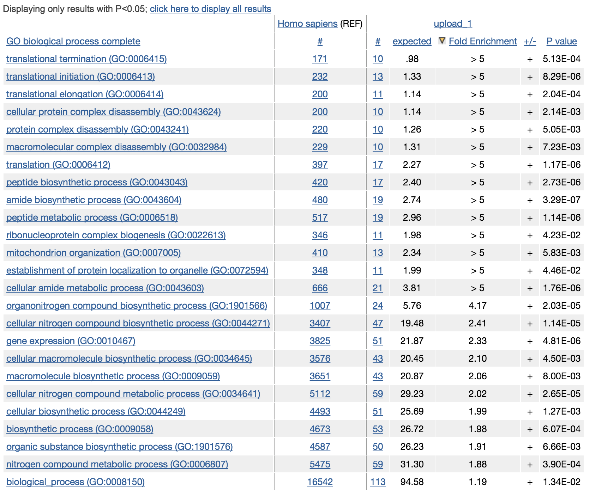

**Last updated:** `r Sys.Date()`

**Code version:** `r system("git log -1 --format='%H'", intern = TRUE)`

```{r chunk-options, include=FALSE}
source("chunk-options.R")

library(knitr)
opts_chunk$set(message = FALSE, warning = FALSE, eval = TRUE, 
               echo = TRUE)
```


## Objective

Investigate noise in gene expression at gene-by-gene basis, defined by DM (distance to the median) - distance of each individual's coefficieint of variation to median coefficient of variation of genes at similar RNA abundance level.


## Set up

```{r, message=FALSE, warning=FALSE}
library("data.table")
library("dplyr")
library("limma")
library("edgeR")
library("ggplot2")
library("grid")
theme_set(theme_bw(base_size = 12))
source("functions.R")
library("Humanzee")
library("cowplot")
library("MASS")
library("matrixStats")
library("mygene")
```


## Prepare data

Input annotation of only QC-filtered single cells, with NA19098.r2 removed.

```{r import-annotation}
anno_filter <- read.table("../data/annotation-filter.txt", 
                      header = TRUE,
                      stringsAsFactors = FALSE)
dim(anno_filter)
head(anno_filter, 2)
```

Import molecule counts after filtering and before any correction.

```{r import-molecule-counts-after-filtering}
molecules_filter <- read.table("../data/molecules-filter.txt",
                               header = TRUE, stringsAsFactors = FALSE)
stopifnot(NROW(anno_filter) == NCOL(molecules_filter))
```

Import final processed molecule counts of endogeneous genes.

```{r import-ensg-final-transformed-log2counts}
molecules_final <- read.table("../data/molecules-final.txt", 
                             header = TRUE, stringsAsFactors = FALSE)
dim(molecules_final)
stopifnot(NROW(anno_filter) == NCOL(molecules_final))
```


Import gene symbols.

```{r}
gene_symbols <- read.table(file = "../data/gene-info.txt", sep = "\t",
                           header = TRUE, stringsAsFactors = FALSE, quote = "")
```

Import cell cycle and pluripotency genes.

```{r}
cell_cycle_genes <- read.table("../data/cellcyclegenes.txt",
                               header = TRUE, sep = "\t",
                               stringsAsFactors = FALSE)

pluripotency_genes <- read.table("../data/pluripotency-genes.txt",
                               header = TRUE, sep = "\t",
                               stringsAsFactors = FALSE)$To
```


Load CV results of all cells

```{r}
load("rda/cv-adjusted-summary-pois-expressed/cv.rda")
```


## Compute DM vlaues (distance-from-the-median)

1. Compute Squared Coefficients of Variation across cells for each individual;
2. Adjust Squared CVs for confounding effect with the mean:
    + Compute rolling medians of gene expression levels,
    + Compute Squared CVs corresponding to rolling medians of gene expression levels,
deviation of adjusted CVs.    


```{r, include = FALSE, echo = FALSE, eval = FALSE}
# Save the cv values to local repository
file_name <- "rda/cv-adjusted-summary-pois-expressed/cv.rda"
if (file.exists(file_name)) {
  load("rda/cv-adjusted-summary-pois-expressed/cv.rda")
} else {

# load functions for computing CVs
source("../code/cv-functions.r")

# Compute individual CVs.
ENSG_cv <- compute_cv(log2counts = molecules_final,
                      grouping_vector = anno_filter$individual)

# Adjust CVs for mean dependency.
ENSG_cv_adj <- normalize_cv(group_cv = ENSG_cv, 
                            log2counts = molecules_final, 
                            anno = anno_filter)
save(ENSG_cv_adj, ENSG_cv,
     file =  "rda/cv-adjusted-summary-pois-expressed/cv.rda")
}
```


### Sanity-check plots. 

Supplemenetal for the Methods section.

```{r sanity-plots-dm, fig.width=8, fig.height=12}
theme_set(theme_bw(base_size = 8))
plot_grid(
  ggplot(data.frame(log10cv_1 = log10(ENSG_cv_adj$NA19098$cv^2),
                    log10cv_2 = log10(ENSG_cv_adj$NA19101$cv^2)),
       aes(x = log10cv_1, y = log10cv_2)) +
    geom_point(cex = .4) +
    xlab("NA19098 log10 squared-CV values") +
    ylab("NA19101 log10 squared-CV values") +
    ggtitle("Relationship between individual DM values") +
    theme(legend.position = "none"),
  ggplot(data.frame(dm1 = ENSG_cv_adj$NA19098$log10cv2_adj,
                    dm2 = ENSG_cv_adj$NA19101$log10cv2_adj),
       aes(x = dm1, y = dm2)) +
    geom_point(cex = .4) +
    xlab("NA19098 DM values") +
    ylab("NA19101 DM values") +
    ggtitle("Relationship between individual DM values") +
    theme(legend.position = "none"),
  ggplot(data.frame(dm = ENSG_cv_adj$NA19098$log10cv2_adj,
                    log10_mean = log10(ENSG_cv_adj$NA19098$mean)),
         aes(x = log10_mean, y = dm)) +
      geom_point(cex = .4) +
      xlab("log10 average molecule count") +
      ylab("DM values") +
      ggtitle("NA19098") +
      theme(legend.position = "none"),
    ggplot(data.frame(dm = ENSG_cv_adj$NA19101$log10cv2_adj,
                    log10_mean = log10(ENSG_cv_adj$NA19101$mean)),
         aes(x = log10_mean, y = dm)) +
      geom_point(cex = .4) +
      xlab("log10 average molecule count") +
      ylab("DM values") +
      ggtitle("NA19101") +
      theme(legend.position = "none"),
  ggplot(data.frame(dm = ENSG_cv_adj$NA19239$log10cv2_adj,
                    log10_mean = log10(ENSG_cv_adj$NA19239$mean)),
         aes(x = log10_mean, y = dm)) +
      geom_point(cex = .4) +
      xlab("log10 average molecule count") +
      ylab("DM values") +
      ggtitle("NA19239") +
      theme(legend.position = "none"),
  ncol = 2,
  labels = LETTERS[1:5] )
```


### Check pluripotency and cell-cycle

Mark cell-cycle genes.

```{r}
genes <- rownames(ENSG_cv[[1]])
ii_cellcycle_genes <- lapply(1:3, function(per_individual) {
  genes %in% unlist(cell_cycle_genes)
})
names(ii_cellcycle_genes) <- names(ENSG_cv)
ii_cellcycle_genes <- do.call(c, ii_cellcycle_genes)

ggplot(data.frame(do.call(rbind, ENSG_cv_adj),
                  dm = c(ENSG_cv_adj$NA19098$log10cv2_adj, 
                         ENSG_cv_adj$NA19101$log10cv2_adj, 
                         ENSG_cv_adj$NA19239$log10cv2_adj) ),
       aes(x = log10(mean), y = dm )) +
  geom_point(aes(col = group), cex = 1.2) + facet_wrap( ~ group) +
  ggtitle("Cell-cycle genes") + 
  geom_point(
      data = subset(data.frame(do.call(rbind, ENSG_cv_adj),
                              dm = c(ENSG_cv_adj$NA19098$log10cv2_adj, 
                                     ENSG_cv_adj$NA19101$log10cv2_adj, 
                                     ENSG_cv_adj$NA19239$log10cv2_adj) ), 
                 ii_cellcycle_genes), 
       colour = "grey20", cex = 1.2) +
  labs(x = "log10 average gene expression level",
       y = "DM values")
```

Mark pluripotent genes

```{r}
ii_pluripotent_genes <- lapply(1:3, function(per_individual) {
  genes %in% unlist(pluripotency_genes)
})
names(ii_pluripotent_genes) <- names(ENSG_cv)
ii_pluripotent_genes <- do.call(c, ii_pluripotent_genes)

ggplot(data.frame(do.call(rbind, ENSG_cv_adj),
                  dm = c(ENSG_cv_adj$NA19098$log10cv2_adj, 
                         ENSG_cv_adj$NA19101$log10cv2_adj, 
                         ENSG_cv_adj$NA19239$log10cv2_adj) ),
       aes(x = log10(mean), y = dm )) +
  geom_point(aes(col = group), cex = 1.2) + facet_wrap( ~ group) +
  ggtitle("Pluripotent genes") + 
  geom_point(
      data = subset(data.frame(do.call(rbind, ENSG_cv_adj),
                              dm = c(ENSG_cv_adj$NA19098$log10cv2_adj, 
                                     ENSG_cv_adj$NA19101$log10cv2_adj, 
                                     ENSG_cv_adj$NA19239$log10cv2_adj) ), 
                 ii_pluripotent_genes), 
       colour = "grey20", cex = 1.2) +
  labs(x = "log10 average gene expression level",
       y = "DM values")
```


## Top ranked DM genes

### Venn diagram, 1000 genes

Top 1000 genes based on DM.

```{r venn-top-1000-dm}
genes <- rownames(ENSG_cv[[1]])
library(gplots)
venn_cv_rank <- gplots::venn(
  list(NA19098 = genes[ which( rank(ENSG_cv_adj$NA19098$log10cv2_adj) 
                               > length(genes) - 1000 ) ],
       NA19101 = genes[ which( rank(ENSG_cv_adj$NA19101$log10cv2_adj) 
                               > length(genes) - 1000 ) ],
       NA19239 = genes[ which( rank(ENSG_cv_adj$NA19239$log10cv2_adj) 
                               > length(genes) - 1000 ) ] ))
```


Bottom 1000 genes based on DM.

```{r venn-bottom-1000-dm}
genes <- rownames(ENSG_cv[[1]])
library(gplots)
gplots::venn(
  list(NA19098 = genes[ which( rank(ENSG_cv_adj$NA19098$log10cv2_adj) 
                               <= 1000 ) ],
       NA19101 = genes[ which( rank(ENSG_cv_adj$NA19101$log10cv2_adj) 
                               <= 1000 ) ],
       NA19239 = genes[ which( rank(ENSG_cv_adj$NA19239$log10cv2_adj) 
                               <= 1000 ) ] ))
```


Top 1000 genes based on Means.

```{r venn-top-1000-means}
genes <- rownames(ENSG_cv[[1]])
library(gplots)
gplots::venn( 
  list(NA19098 = genes[ which(rank(ENSG_cv[[1]]$mean) > length(genes) - 1000 ) ],
       NA19101 = genes[ which(rank(ENSG_cv[[2]]$mean) > length(genes) - 1000 ) ],
       NA19239 = genes[ which(rank(ENSG_cv[[3]]$mean) > length(genes) - 1000 ) ] ) )
```


Mark top ranked genes based on individual DM values.


```{r, fig.width = 8, fig.height = 8}
df_plot <- data.frame(
  cvs = c(ENSG_cv_adj[[1]]$log10cv2_adj, ENSG_cv_adj[[2]]$log10cv2_adj,
          ENSG_cv_adj[[3]]$log10cv2_adj),
  means = c(ENSG_cv[[1]]$mean, ENSG_cv[[2]]$mean, ENSG_cv[[3]]$mean),
  individual = as.factor(rep(names(ENSG_cv), each = NROW(ENSG_cv[[1]])) ) ) 

cowplot::plot_grid(
  ggplot( df_plot,
        aes(x = log10(means), y = cvs ) ) +
        geom_point( aes(col = as.factor(individual)), cex = 1.2 ) + 
        facet_wrap( ~ individual) +
        labs(x = "log10 average gene expression level", 
             y = "DM values") +
        geom_point(
          data = df_plot[ rep( rank(ENSG_cv_adj$NA19098$log10cv2_adj) 
                               > length(genes) - 1000, 3), ],
          colour = "grey20", cex = 1.2 ) +
        ggtitle("Top 1,000 genes in NA19098 based on DM values") +
        theme(legend.position = "none"),
  ggplot( df_plot,
        aes(x = log10(means), y = cvs ) ) +
        geom_point( aes(col = as.factor(individual)), cex = 1.2 ) + 
        facet_wrap( ~ individual) +
        labs(x = "log10 average gene expression level", 
             y = "DM values") +
        geom_point(
          data = df_plot[ rep( rank(ENSG_cv_adj$NA19101$log10cv2_adj) 
                               > length(genes) - 1000, 3), ],
          colour = "grey20", cex = 1.2 ) +
        ggtitle("Top 1,000 genes in NA19101 based on DM values") +
        theme(legend.position = "none"),
  ggplot( df_plot,
        aes(x = log10(means), y = cvs ) ) +
        geom_point( aes(col = as.factor(individual)), cex = 1.2 ) + 
        facet_wrap( ~ individual) +
        labs(x = "log10 average gene expression level", 
             y = "DM values") +
        geom_point(
          data = df_plot[ rep( rank(ENSG_cv_adj$NA19239$log10cv2_adj) 
                               > length(genes) - 1000, 3), ],
          colour = "grey20", cex = 1.2 ) +
        ggtitle("Top 1,000 genes in NA19239 based on DM values") +
        theme(legend.position = "none"),
  labels = LETTERS[1:4] )  
```


### Venn diagram, 100 genes

Top 100 genes based on DM.

```{r venn-top-100-dm}
genes <- rownames(ENSG_cv[[1]])
library(gplots)
venn_cv_rank <- gplots::venn(
  list(NA19098 = genes[ which( rank(ENSG_cv_adj$NA19098$log10cv2_adj) 
                               > length(genes) - 100 ) ],
       NA19101 = genes[ which( rank(ENSG_cv_adj$NA19101$log10cv2_adj) 
                               > length(genes) - 100 ) ],
       NA19239 = genes[ which( rank(ENSG_cv_adj$NA19239$log10cv2_adj) 
                               > length(genes) - 100 ) ] ))
```


Bottom 100 genes based on DM.

```{r venn-bottom-100-dm}
genes <- rownames(ENSG_cv[[1]])
library(gplots)
gplots::venn(
  list(NA19098 = genes[ which( rank(ENSG_cv_adj$NA19098$log10cv2_adj) 
                               <= 100 ) ],
       NA19101 = genes[ which( rank(ENSG_cv_adj$NA19101$log10cv2_adj) 
                               <= 100 ) ],
       NA19239 = genes[ which( rank(ENSG_cv_adj$NA19239$log10cv2_adj) 
                               <= 100 ) ] ))
```


Top 100 genes based on Means.

```{r venn-top-100-means}
genes <- rownames(ENSG_cv[[1]])
library(gplots)
gplots::venn( 
  list(NA19098 = genes[ which(rank(ENSG_cv[[1]]$mean) > length(genes) - 100 ) ],
       NA19101 = genes[ which(rank(ENSG_cv[[2]]$mean) > length(genes) - 100 ) ],
       NA19239 = genes[ which(rank(ENSG_cv[[3]]$mean) > length(genes) - 100 ) ] ) )
```


### GO analysis - individual top genes

Analyze top 1,000 genes in DM values.

```{r, eval = FALSE}
# output top 1000 genes in DM values
top1000DM_genes <-
  data.frame(NA19098 = genes[ which( rank(ENSG_cv_adj$NA19098$log10cv2_adj) 
                               > length(genes) - 1000 ) ],
       NA19101 = genes[ which( rank(ENSG_cv_adj$NA19101$log10cv2_adj) 
                               > length(genes) - 1000 ) ],
       NA19239 = genes[ which( rank(ENSG_cv_adj$NA19239$log10cv2_adj) 
                               > length(genes) - 1000 ) ],
       stringsAsFactors = FALSE)

# write the gene names out to a text file,
# then copy and paste to GO Consortium interface
for (ind in c("NA19098", "NA19101", "NA19239")) {
  write.table(top100DM_genes[[ind]],
              file = paste0("../data/top-100-dm-",ind,".txt"),
              sep = "/t", quote = FALSE,
              col.names = FALSE, row.names = FALSE)
}
for (ind in c("NA19098", "NA19101", "NA19239")) {
  write.table(top1000DM_genes[[ind]],
              file = paste0("../data/top-1000-dm-",ind,".txt"),
              sep = "/t", quote = FALSE,
              col.names = FALSE, row.names = FALSE)
}
write.table(rownames(molecules_final),
            file = "../data/gene-names.txt",
            sep = "/t", quote = FALSE,
            col.names = FALSE, row.names = FALSE)
```


#### GO consortium

We found no significant GO terms in PANTHER database.


#### GOStats

Not yet figured out how to get genes associated with each sig. GO terms.

*[Chunk not evaluated]*
```{r, eval = FALSE}
require(Humanzee)
# Find GO terms
go_top1000_results <- lapply(c("NA19098", "NA19101", "NA19239"),
    function(individual) {
        go_list <- lapply(c("BP", "MF", "CC"), function(term) {
              sig_gene_go <- GOtest(rownames(molecules_final),
                                    top1000DM_genes[[individual]],
                                    ontology = term,
                                    conditional.method = F)
              
              
              go_data <- goHeatmapData(list(summary(sig_gene_go$GO[[term]], 
                                                    pvalue = .01)))
              return(go_data)
        })
        names(go_list) <- c("BP", "MF", "CC")
        return(go_list)      
})
names(go_top1000_results) <- c("NA19098", "NA19101", "NA19239")

go_gene_list <- sig_gene_go[["GO"]][[1]]@goDag@nodeData@data
go_gene_list_names <- names(go_gene_list)
go_sig <- which(go_gene_list_names %in% go_data[,1])
go_gene_list_sig <- go_gene_list[go_sig]
length(go_gene_list_sig)
go_gene_list_sig
head(go_data)
# Plot heatmap
go_heatmap <- plotHeatmap(go_data, 
                          labCol = "")
```


#### CPDB

ConsensusPATHDB-Human was used to perform GO over-representation analysis.


*NA19098*

```{r}
go_NA19098 <- 
  read.table("figure/cv-adjusted-summary-pois.Rmd/go-cpdb-top-1000-dm-NA19098.tab",
               sep = "\t",
               header = TRUE)
go_NA19098_sig <- go_NA19098[go_NA19098$q.value < .1, ]
go_NA19098_sig$term_name
```


*NA19101*

```{r}
go_NA19101 <- read.table("figure/cv-adjusted-summary-pois.Rmd/go-cpdb-top-1000-dm-NA19101.tab",
                         sep = "\t",
                         header = TRUE)
head(go_NA19101$q.value)
go_NA19101_sig <- go_NA19101[go_NA19101$q.value < .1, ]
go_NA19101_sig$term_name
```


*NA19239*

```{r}
go_NA19239 <- read.table("figure/cv-adjusted-summary-pois.Rmd/go-cpdb-top-1000-dm-NA19239.tab",
           sep = "\t",
           header = TRUE)
go_NA19239_sig <- go_NA19239[go_NA19239$q.value < .1, ]

go_NA19239_sig$term_name
```


*Why is there so many more GO terms in NA19239 than the other two individuals?

*[Chunk not evaluated]*
```{r, eval = FALSE}
top1000DM_genes <-
  data.frame(NA19098 = genes[ which( rank(ENSG_cv_adj$NA19098$log10cv2_adj) 
                               > length(genes) - 1000 ) ],
       NA19101 = genes[ which( rank(ENSG_cv_adj$NA19101$log10cv2_adj) 
                               > length(genes) - 1000 ) ],
       NA19239 = genes[ which( rank(ENSG_cv_adj$NA19239$log10cv2_adj) 
                               > length(genes) - 1000 ) ],
       stringsAsFactors = FALSE)

par(mfrow = c(2,2))
boxplot(cbind(ENSG_cv_adj$NA19101$log10cv2_adj[which( rank(ENSG_cv_adj$NA19101$log10cv2_adj) 
                               > length(genes) - 1000 )],
              ENSG_cv_adj$NA19239$log10cv2_adj[which( rank(ENSG_cv_adj$NA19239$log10cv2_adj) 
                               > length(genes) - 1000 )]) )
title(main = "adjusted CV")

boxplot(
  cbind(ENSG_cv_adj$NA19101$mean[ which( rank(ENSG_cv_adj$NA19101$log10cv2_adj)
                                        > length(genes) - 1000 )],
        ENSG_cv_adj$NA19239$mean[which( rank(ENSG_cv_adj$NA19239$log10cv2_adj) 
                               > length(genes) - 1000 )]) )

```


### GO analysis - shared noisy genes


```{r, eval = FALSE}
shared_venn <- gplots::venn(
  list(NA19098 = genes[ which( rank(ENSG_cv_adj$NA19098$log10cv2_adj) 
                               > length(genes) - 1000 ) ],
       NA19101 = genes[ which( rank(ENSG_cv_adj$NA19101$log10cv2_adj) 
                               > length(genes) - 1000 ) ],
       NA19239 = genes[ which( rank(ENSG_cv_adj$NA19239$log10cv2_adj) 
                               > length(genes) - 1000 ) ] ) )

shared_genes <- attr(shared_venn, "intersections")[['111']]

# write.table(shared_genes,
#             file = ("../data/top-1000-dm-shared.txt"),
#             sep = "/t", quote = FALSE,
#            col.names = FALSE, row.names = FALSE)
```

ConsensusPATHDB-Human was used to perform GO over-representation analysis.

Of the 120 noisy genes that are common to all three individual cell lines, 38 of the genes are over-represented in the following functions: 

```{r}
go_top_shared <- read.table("figure/cv-adjusted-summary-pois.Rmd/go-cpdb-top-1000-shared.tab",
                         sep = "\t",
                         header = TRUE)
go_top_shared <- go_top_shared[go_top_shared$q.value < .1, ]
go_top_shared$term_name

go_top_shared_genes <- getGenes(gsub(";", ",",
                    as.character(go_top_shared$members_input_overlap_geneids)))
go_top_shared_genes <- go_top_shared_genes[!duplicated(go_top_shared_genes[ , "symbol"]), ]
kable(data.frame(symbol = go_top_shared_genes[ ,"symbol"],
                  name = go_top_shared_genes[,"name"]) )
```


## Differential DMs 

Compute median of absolute deviations (MAD) to quantify dissimilarity of the individual DM meausres. 

```{r}
library(matrixStats)
dm_matrix <- as.matrix(
                data.frame(NA19098 = ENSG_cv_adj$NA19098$log10cv2_adj,
                           NA19101 = ENSG_cv_adj$NA19101$log10cv2_adj,
                           NA19239 = ENSG_cv_adj$NA19239$log10cv2_adj) )
mad <- rowMedians( abs( dm_matrix - rowMedians(dm_matrix) ) )
```


### Top 100 ranked genes by MAD. 


ConsensusPATHDB-Human was used to perform GO over-representation analysis.

Look up top 100 genes in MAD values

```{r}
mad_genes <- rownames(molecules_final)[rank(mad) > 
                                             (length(mad) - 100) ]
#write.table(mad_genes,
#            file = "../data/mad-genes.txt",
#            sep = "\t", quote = FALSE,
#            col.names = FALSE, row.names = FALSE)
```

```{r}
library(mygene)
go_top <- read.table("figure/cv-adjusted-summary-pois.Rmd/go-cpdb-all-top.tab",
                         sep = "\t",
                         header = TRUE)
go_top <- go_top[go_top$q.value < .1, ]
as.character(go_top$term_name)

# go_top_genes <- getGenes(gsub(";", ",",
#                     as.character(go_top$members_input_overlap_geneids)))
# go_top_genes <- go_top_genes[!duplicated(go_top_genes[ , "symbol"]), ]
# kable(data.frame(symbol =go_top_genes[ ,"symbol"],
#                  name = go_top_genes[,"name"]) )
```


### Permutation-based test

All computations are done in midway.

Compute MAD based on permuted data.

Export data to rda format and then transport them to midway for permutation-based
test. 

*[Chunk not evaluted]*
```{r output-rdas-for-computing-permuted-pvals, eval = FALSE}
if (!file.exists("rda/cv-adjusted-summary-pois/adj-cv.rda")) {
  save(mad, file = "rda/cv-adjusted-summary-pois/adj-cv.rda")
}


if (!file.exists("rda/cv-adjusted-summary-pois/permute-cv-test.rda")) {
  save(molecules_final, anno_filter,
       file = "rda/cv-adjusted-summary-pois/permute-cv-test.rda")
}
```

*[Chunk not evaluated]*
```
sbatch permute-cv-test.sbatch
```

Compute permutation-based p-values for each gene.

*[Chunk not evaluated]*
```
sbatch permuted-cv-compute-pval.sbatch
```

Import permutation results.

```{r}
load("../data/permuted-pval.rda")
sum(permuted_pval$mad_pval == 0)
```


Histogram of permuted p-values. Supplemental figure.

```{r}
ggplot( data.frame(pvals = permuted_pval$mad_pval),
       aes(x = pvals) ) +
  geom_histogram() + xlim(0, 1) +
  labs(x = "Permutation-based p-values", y = "Count")
```

Permuted p-values versus mean gene expression. Supplemental figure?

```{r}
ggplot( data.frame(pvals = permuted_pval$mad_pval,
                   gene_mean = rowMeans(as.matrix(molecules_final))),
       aes(x = gene_mean, y = -log10(pvals) ) ) +
  geom_point() 
```

Export genes with significant MAD values.

```{r}
genes_sig_mad <- data.frame(
  ensg = rownames(molecules_final)[which(permuted_pval$mad_pval == 0)],
  mad_value = mad[ which(permuted_pval$mad_pval ==0) ])
genes_sig_mad$gene_names <-
  gene_symbols$external_gene_name[match(genes_sig_mad$ensg, gene_symbols$ensembl_gene_id)]
genes_sig_mad$is_cell_cycle <- genes_sig_mad$ensg %in% unlist(cell_cycle_genes)
genes_sig_mad$is_pluripotent <- genes_sig_mad$ensg %in% unlist(pluripotency_genes)


genes_sig_mad <- genes_sig_mad[order(genes_sig_mad$mad_value, 
                                     decreasing = TRUE), ]
head(genes_sig_mad)

# if (!file.exists("../data/sig-permute-gene.txt")) {
# write.table(genes_sig_mad,
#             file = "../data/sig-permute-gene.txt",
#             col.names = TRUE, row.names = FALSE, sep = "\t",
#             quote = FALSE)
# }
```


Select columns from "sig-permute-gene.txt" for GO anlaysis on different platforms. 

*[Chunk not evaluated]*
```{r, eval = FALSE}
write.table(genes_sig_mad[ ,3],
          file = "../data/sig-permute-gene-symbol-only.txt",
          col.names = FALSE, row.names = FALSE, sep = "\t",
          quote = FALSE)
write.table(genes_sig_mad[ ,1],
          file = "../data/sig-permute-gene-ensg-only.txt",
          col.names = FALSE, row.names = FALSE, sep = "\t",
          quote = FALSE)
write.table(genes_sig_mad[,c(1,2)],
          file = "../data/sig-permute-gene-ensg-and-pvalue.txt",
          col.names = FALSE, row.names = FALSE, sep = "\t",
          quote = FALSE)
}
```


Genes with p = 0 sorted by MAD. Print out the density distributions to a pdf file 
for exploratory data analysis. 

*[Chunk not evaluated]*
```{r, eval = FALSE}
if(!file.exists("figure/cv-adjusted-summary-pois.Rmd/density-sig-mad.pdf")) {
    pdf(file = "figure/cv-adjusted-summary-pois.Rmd/density-sig-mad.pdf",
        height = 12, width = 8)
    par(mfrow = c(5,4), cex = .7)
    for(i in 1:dim(genes_sig_mad)[1]) {
      plot_density_overlay(molecules_ENSG = molecules_final,
                   genes_sig_mad$ensg[i], 
                   labels = round(genes_sig_mad$mad[i], 6),
                   gene_symbols = gene_symbols)
    }
    dev.off()
}
```


### Heatmap of differential genes

Print heatmaps of differential genes to a pdf file. These do not reveal any
interesting patterns. 

*[Chunk not evaluated]*
```{r, eval = FALSE}
library(gplots)
library(broman)
crayon <- brocolors("crayon")
file_name <- "../analysis/figure/cv-adjusted-summary-pois.Rmd/heatmap-sig-genes.pdf"
if(!file.exists(file_name)) {
    pdf(file = file_name,
        height = 14, width = 10)
    select_significant_genes <- which(permuted_pval$mad_pval == 0 )
    for (individual in unique(anno_filter$individual)) {
    xx <- molecules_final[ select_significant_genes, 
                            anno_filter$individual == individual]
    xx <- xx[order(mad[select_significant_genes], decreasing = TRUE), ]
    heatmap.2(as.matrix(xx)[ order( mad[select_significant_genes] ), ], 
      breaks = seq(0, 9, by = 1),
      symm = F, symkey = F, symbreaks = T, scale="none",
      Rowv = TRUE, Colv = TRUE,
      dendrogram = "both",
      trace = "none",
      labRow = with(gene_symbols, 
                    external_gene_name[match(rownames(xx), ensembl_gene_id)] ), 
               labCol = "",
              col = crayon[c("Violet Blue", "Pacific Blue", "Shamrock",
                             "Sea Green", "Sky Blue", "Yellow",
                             "Violet Red", "Mango Tango", "Scarlet")],
              keysize = 1,
              key.xlab = NULL, key.title = "log2 Gene expression")
    }
    dev.off()
}


file_name <- "../analysis/figure/cv-adjusted-summary-pois.Rmd/heatmap-sig-genes-all-individuals.pdf"
if(!file.exists(file_name)) {
    pdf(file = file_name,
        height = 10, width = 14)
    select_significant_genes <- which(permuted_pval$mad_pval == 0 )
    xx <- molecules_final[ select_significant_genes, ]
    xx <- xx[order(mad[select_significant_genes], decreasing = TRUE), ]
    heatmap.2(as.matrix(xx)[ order( mad[select_significant_genes] ), ], 
      breaks = seq(0, 9, by = 1),
      symm = F, symkey = F, symbreaks = T, scale="none",
      Rowv = TRUE, Colv = FALSE,
      dendrogram = "row",
      trace = "none",
      labRow = with(gene_symbols, 
                    external_gene_name[match(rownames(xx), ensembl_gene_id)] ), 
               labCol = "",
              col = crayon[c("Violet Blue", "Pacific Blue", "Shamrock",
                             "Sea Green", "Sky Blue", "Yellow",
                             "Violet Red", "Mango Tango", "Scarlet")],
              keysize = 1,
              key.xlab = NULL, key.title = "log2 Gene expression")
    dev.off()
}
```


#### Over-represntation analysis


##### Gene Ontology Consortium

Search PANTHER database.

 


##### GOStats

Below is not run. The code here is based on annotation results from GOstats. We decided for now to use resutls from GO Ontology Consortium.

*[Chunk not evaluated]*
```{r, eval = FALSE}
require(Humanzee)
# Find GO terms
sig_gene_go <- GOtest(rownames(molecules_final),
                      genes_sig_mad[,1],
                      ontology = "BP",
                      conditional.method = F)

# Prepare GO terms for heatmap plotting
go_data <- goHeatmapData(list(summary(sig_gene_go$GO$BP, pvalue = .01)))

# Plot heatmap
go_heatmap <- plotHeatmap(go_data, 
                          labCol = "")
```


##### CPDB

ConsensusPATHDB-Human was used to perform GO over-representation analysis.


```{r}
go_sig <- read.table("figure/cv-adjusted-summary-pois.Rmd/go-cpdb-sig-dm.tab",
                         sep = "\t",
                         header = TRUE)
go_sig <- go_sig[go_sig$q.value < .1, ]
as.character(go_sig$term_name)
```


## Top DM-ranked genes vs. differential genes

Top genes in each individual

```{r}
genes_top1000 <-data.frame(
  NA19098 = genes[ which( rank(ENSG_cv_adj$NA19098$log10cv2_adj) 
                               > length(genes) - 1000 ) ],
  NA19101 = genes[ which( rank(ENSG_cv_adj$NA19101$log10cv2_adj) 
                               > length(genes) - 1000 ) ],
  NA19239 = genes[ which( rank(ENSG_cv_adj$NA19239$log10cv2_adj) 
                               > length(genes) - 1000 ) ] ) 
```

Sig. genes

```{r}
genes_sig_mad <- data.frame(
  ensg = rownames(molecules_final)[which(permuted_pval$mad_pval == 0)] )
genes_sig_mad$gene_names <- gene_symbols$external_gene_name[
  match(genes_sig_mad$ensg, gene_symbols$ensembl_gene_id)]
genes_sig_mad$is_cell_cycle <- genes_sig_mad$ensg %in% unlist(cell_cycle_genes)
genes_sig_mad$is_pluripotent <- genes_sig_mad$ensg %in% unlist(pluripotency_genes)
```


Which ones of significant genes are also in the top ranked genes 

94 genes

```{r}
overlap_list <- lapply(c(1:3), function(ii) {
  as.character(genes_sig_mad$ensg)[
    which( as.character(genes_sig_mad$ensg) %in% genes_top1000[[ii]]) ]  
})
overlap_list

length( c(overlap_list[[1]], overlap_list[[2]], overlap_list[[3]]) )

length(Reduce("union",
       list(overlap_list[[1]], overlap_list[[2]], overlap_list[[3]]) ) )

write(unique( c(overlap_list[[1]], overlap_list[[2]], overlap_list[[3]]) ),
      file = "../data/overlap-sig-top-dm-genes", sep = "\t")
```


*CPDB

```{r}
go_overlap <- read.table("figure/cv-adjusted-summary-pois.Rmd/go-cpdb-overlap-sig-top-dm.tab",
                         sep = "\t", header = TRUE,
                         stringsAsFactors = FALSE)
go_overlap <- go_overlap[go_overlap$q.value < .1, ]
go_overlap$term_name

go_overlap_genes <- getGenes(gsub(";", ",",
                    as.character(go_overlap$members_input_overlap_geneids)))
go_overlap_genes <- go_overlap_genes[!duplicated(go_overlap_genes[ , "symbol"]), ]
kable(data.frame(symbol =go_overlap_genes[ ,"symbol"],
                  name = go_overlap_genes[,"name"]) )
```


## Top MAD genes vs. differential genes

MAD genes in each individual

```{r}
par(mfrow = c(1,1))
gplots::venn(list(
  MAD = rownames(molecules_final)[rank(mad) > (length(mad) - 100)],
  PERM = rownames(molecules_final)[which(permuted_pval$mad_pval == 0)] ) )
```


MAD in the top 1000 genes of each individual?

```{r}
MAD = rownames(molecules_final)[rank(mad) > (length(mad) - 100)]
genes_top1000 <-data.frame(
  NA19098 = genes[ which( rank(ENSG_cv_adj$NA19098$log10cv2_adj) 
                               > length(genes) - 1000 ) ],
  NA19101 = genes[ which( rank(ENSG_cv_adj$NA19101$log10cv2_adj) 
                               > length(genes) - 1000 ) ],
  NA19239 = genes[ which( rank(ENSG_cv_adj$NA19239$log10cv2_adj) 
                               > length(genes) - 1000 ) ] ) 
overlap_list <- lapply(c(1:3), function(ii) {
  as.character(MAD)[
    which( MAD %in% genes_top1000[[ii]]) ]  
})
length( c(overlap_list[[1]], overlap_list[[2]], overlap_list[[3]]) )
length( unique(c(overlap_list[[1]], overlap_list[[2]], overlap_list[[3]])))
length( Reduce("intersect",
               list(overlap_list[[1]], overlap_list[[2]], overlap_list[[3]])))
```


Which ones of significant genes are also in the top MAD genes

62

```{r}
overlap_list <- intersect(
  rownames(molecules_final)[rank(mad) > (length(mad) - 100)],
  rownames(molecules_final)[which(permuted_pval$mad_pval == 0)] )

#write(overlap_list,
#      file = "../data/overlap-sig-mad-dm-genes", sep = "\t")
```


### CPDB


```{r}
go_overlap <- read.table("figure/cv-adjusted-summary-pois.Rmd/go-cpdb-mad-dm.tab",
                         sep = "\t", header = TRUE,
                         stringsAsFactors = FALSE)
go_overlap <- go_overlap[go_overlap$q.value < .1, ]
go_overlap$term_name

# go_overlap_genes <- getGenes(gsub(";", ",",
#                     as.character(go_overlap$members_input_overlap_geneids)))
# go_overlap_genes <- go_overlap_genes[!duplicated(go_overlap_genes[ , "symbol"]), ]
# kable(data.frame(symbol =go_overlap_genes[ ,"symbol"],
#                  name = go_overlap_genes[,"name"]) )
```

## Session information

```{r info}
sessionInfo()
```
