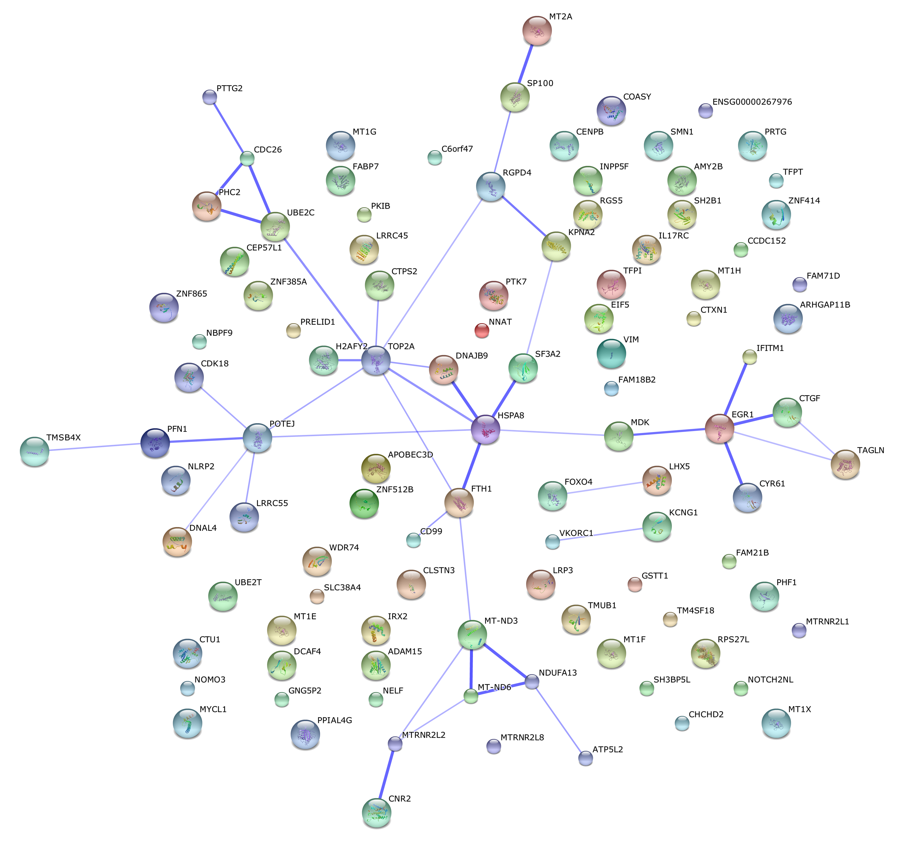
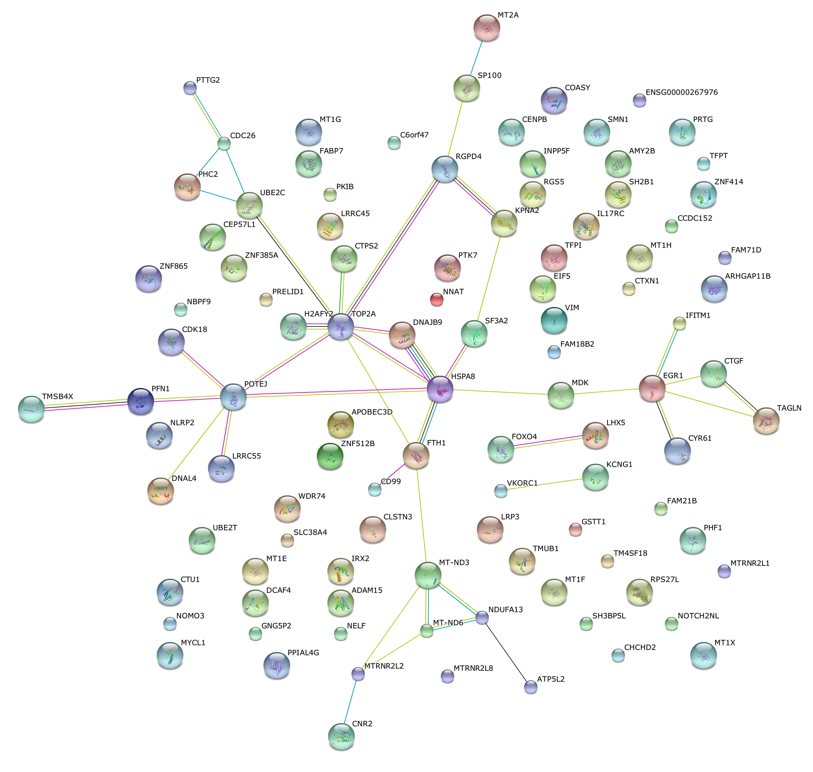

**Last updated:** `r Sys.Date()`

**Code version:** `r system("git log -1 --format='%H'", intern = TRUE)`

```{r chunk-options, include=FALSE}
source("chunk-options.R")

library(knitr)
opts_chunk$set(message = FALSE, warning = FALSE, eval = TRUE, 
               echo = TRUE)
``` 


## Objective

Previously, we compared normalized coefficient of variations across individuals. Here, we will also compare the mean gene expression across individuals, using single cell sequencing data and bulk RNA-seq data.

It would be interesting to learn the possible overlap or non-overlap between the genes that we observed significant individual differences in coefficient of variations versus those different in mean gene expression levels across cells.

From here on we will work with the filtered data without NA19098.r2. 

## Set up

```{r, message=FALSE, warning=FALSE}
library("data.table")
library("dplyr")
library("limma")
library("edgeR")
library("ggplot2")
library("grid")
theme_set(theme_bw(base_size = 12))
source("functions.R")
```


## Prepare data

Input annotation of only QC-filtered single cells. Remove NA19098.r2

```{r}
anno_qc_filter <- read.table("../data/annotation-filter.txt", header = TRUE,
                   stringsAsFactors = FALSE)
```


Import endogeneous gene molecule counts that are QC-filtered, CPM-normalized, ERCC-normalized, and also processed to remove unwanted variation from batch effet. ERCC genes are removed from this file.

```{r}
molecules_ENSG <- read.table("../data/molecules-final.txt", header = TRUE, stringsAsFactors = FALSE)
```

Input moleclule counts before log2 CPM transformation. This file is used to compute percent zero-count cells per sample.

```{r}
molecules_sparse <- read.table("../data/molecules-filter.txt", header = TRUE, stringsAsFactors = FALSE)

molecules_sparse <- molecules_sparse[grep("ENSG", rownames(molecules_sparse)), ]
stopifnot( all.equal(rownames(molecules_ENSG), rownames(molecules_sparse)) )
```


## Normalize coefficient of variation

Compute coefficient of variation.

```{r}
# Compute CV and mean of normalized molecule counts (take 2^(log2-normalized count))

molecules_cv_batch_ENSG <- 
  lapply(1:length(unique(anno_qc_filter$batch)), function(per_batch) {
      molecules_per_batch <- 2^molecules_ENSG[ , unique(anno_qc_filter$batch) == unique(anno_qc_filter$batch)[per_batch] ]
      mean_per_gene <- apply(molecules_per_batch, 1, mean, na.rm = TRUE)
      sd_per_gene <- apply(molecules_per_batch, 1, sd, na.rm = TRUE)
      cv_per_gene <- data.frame(mean = mean_per_gene,
                                sd = sd_per_gene,
                                cv = sd_per_gene/mean_per_gene)
      rownames(cv_per_gene) <- rownames(molecules_ENSG)
  
      # cv_per_gene <- cv_per_gene[rowSums(is.na(cv_per_gene)) == 0, ]
      cv_per_gene$batch <- unique(anno_qc_filter$batch)[per_batch]
      
      # Add sparsity percent
      molecules_sparse_per_batch <- molecules_sparse[ , unique(anno_qc_filter$batch) == unique(anno_qc_filter$batch)[per_batch]]
      cv_per_gene$sparse <- rowMeans(as.matrix(molecules_sparse_per_batch) == 0)
        
      return(cv_per_gene)
      }) 
names(molecules_cv_batch_ENSG) <- unique(anno_qc_filter$batch)
```

Merge summary data.frames.

```{r}
df_ENSG <- do.call(rbind, molecules_cv_batch_ENSG)
```

Compute rolling medians across all samples.

```{r}
library(zoo)
# Compute a data-wide coefficient of variation on CPM normalized counts.
data_cv_ENSG <- apply(2^molecules_ENSG, 1, sd)/apply(2^molecules_ENSG, 1, mean)

# Order of genes by mean expression levels
order_gene <- order(apply(2^molecules_ENSG, 1, mean))

# Rolling medians of log10 squared CV by mean expression levels
roll_medians <- rollapply(log10(data_cv_ENSG^2)[order_gene], width = 50, by = 25,
                         FUN = median, fill = list("extend", "extend", "NA") )
ii_na <- which( is.na(roll_medians) )
roll_medians[ii_na] <- median( log10(data_cv_ENSG^2)[order_gene][ii_na] )

names(roll_medians) <- rownames(molecules_ENSG)[order_gene]


# re-order rolling medians
reorder_gene <- match(rownames(molecules_ENSG), names(roll_medians) )
roll_medians <- roll_medians[ reorder_gene ]

stopifnot( all.equal(names(roll_medians), rownames(molecules_ENSG) ) )
```


Compute adjusted coefficient of variation.

```{r}
# adjusted coefficient of variation on log10 scale
log10cv2_adj_ENSG <- 
  lapply(1:length(molecules_cv_batch_ENSG), function(per_batch) {
    foo <- log10(molecules_cv_batch_ENSG[[per_batch]]$cv^2) - roll_medians
    return(foo)
})
df_ENSG$log10cv2_adj_ENSG <- do.call(c, log10cv2_adj_ENSG)
```


## Compare coefficients of variations

```{r}
library(limma)

df_limma <- matrix(df_ENSG$log10cv2_adj_ENSG, 
                      nrow = nrow(molecules_ENSG), ncol = 8, byrow = FALSE)

design <- data.frame(individual = factor(rep(unique(anno_qc_filter$individual), each = 3) ),
                     rep = factor(rep(c(1:3), times = 3)) )
design <- design[ with(design, !(individual == "NA19098" & rep == "2")), ]

colnames(df_limma) <- with(design, paste0(individual, rep))

fit_limma <- lmFit(df_limma, design = model.matrix( ~ individual, data = design))                      
fit_limma <- eBayes(fit_limma)
```


False discovery control adjustment.

```{r}
F.p.adj <- p.adjust(fit_limma$F.p.value, method = "fdr")
```


Cutoffs

```{r}
df_cuts <- data.frame(cuts = c(.001, .01, .05, .1, .15, .2))
df_cuts$sig_count <- sapply(1:6, function(per_cut) {
                    sum(F.p.adj < df_cuts$cuts[per_cut] )
                    })
df_cuts
```


False discovery control adjutment.

```{r}
F.p.adj <- p.adjust(fit_limma$F.p.value, method = "fdr")
```


### Squared CV vs. mean expression level

We plotted out per gene average CVs across samples versus average expression level for the endogeneous genes, and identified the genes classifed as significantly different between individuals in coefficients of variation.


```{r}
df_compare <- 
  data.frame(mean = rowMeans( as.matrix( 
                      do.call(cbind, lapply(molecules_cv_batch_ENSG, "[[", 1) ) ) ),
             cv2 = rowMeans( as.matrix( 
                      do.call(cbind, lapply(molecules_cv_batch_ENSG, "[[", 3) ) )^2 ),
             adj_cv2 = rowMeans( 10^as.matrix( 
                      do.call(cbind, log10cv2_adj_ENSG) ) ) )
             
library(broman)
crayon <- brocolors("crayons")
par(mar=c(5,5,3,1))
with(df_compare, plot(x = log10(mean), y = cv2, pch = 1, cex = 1, col = "grey50",
                      lwd = .5,
                      ylab = "average squared coeffcient of variations \n across samples",
                      xlab = "log10 average of mean CPM across samples") )
with(df_compare[F.p.adj < .2, ], points(x = log10(mean), y = cv2, pch = 16, cex = .6,
                                        col = crayon["Tumbleweed"]) )
with(df_compare[F.p.adj < .1, ], points(x = log10(mean), y = cv2, pch = 16, cex = .6,
                                        col = crayon["Orange"]) )
with(df_compare[F.p.adj < .01, ], points(x = log10(mean), y = cv2, pch = 16, cex = .6,
                                        col = crayon["Scarlet"]) )
title(main = "Avg. Squred CV vs. log10(Avg. mean count)")
legend("topright", pch = c(1, 16, 16, 16), 
       legend = c("All genes", "Adj p-value < .2", 
                  "Adj p-value < .1", "Adj p-value < .01"),
       col = c("grey50", crayon[c("Tumbleweed", "Orange", "Scarlet")]),
       bty = "n")
```


```{r}
par(mar=c(5,5,3,1))
with(df_compare, plot(x = log10(mean), y = adj_cv2, pch = 1, cex = 1, col = "grey50",
                      lwd = .5,
                      ylab = "average squared coeffcient of variations \n across samples",
                      xlab = "log10 average of mean CPM across samples") )
with(df_compare[F.p.adj < .2, ], points(x = log10(mean), y = adj_cv2, pch = 16, cex = .6,
                                        col = crayon["Tumbleweed"]) )
with(df_compare[F.p.adj < .1, ], points(x = log10(mean), y = adj_cv2, pch = 16, cex = .6,
                                        col = crayon["Orange"]) )
with(df_compare[F.p.adj < .01, ], points(x = log10(mean), y = adj_cv2, pch = 16, cex = .6,
                                        col = crayon["Scarlet"]) )
title(main = "Avg. Adjusted Squred CV vs. log10(Avg. mean count)")
legend("topright", pch = c(1, 16, 16, 16), 
       legend = c("All genes", "Adj p-value < .2", 
                  "Adj p-value < .1", "Adj p-value < .01"),
       col = c("grey50", crayon[c("Tumbleweed", "Orange", "Scarlet")]),
       bty = "n")
```


### Investigate...

Our naive analysis seems to pick up genes with different density between individuals.

```{r, fig.width = 12, fig.height=12}
library(gridExtra)
order_low_cv <- order(df_compare[F.p.adj < .01, ]$cv)
low_plots <- lapply(1:6, function(i) {
  ind <- order_low_cv[i]
  ggplot(data.frame(values = unlist(molecules_ENSG[ind, ]),
                    individual = factor(anno_qc_filter$individual),
                    replicate = factor(anno_qc_filter$replicate),
                    batch = factor(anno_qc_filter$batch), check.rows = F), 
         aes(x = values)) + 
    geom_density(aes(group = batch, col = individual)) + 
    ggtitle(paste(rownames(molecules_ENSG)[ind],
                  ";CV = ", round(df_compare[F.p.adj < .01, ]$cv[ind], 2) ) )
})
grid.arrange(grobs = low_plots, ncol = 2)
```


```{r, fig.width=12, fig.height=12}
order_high_cv <- order(df_compare[F.p.adj < .01, ]$cv, decreasing = TRUE)
high_plots <- lapply(1:6, function(i) {
  ind <- order_high_cv[i]
  ggplot(data.frame(values = unlist(molecules_ENSG[ind, ]),
                    individual = factor(anno_qc_filter$individual),
                    replicate = factor(anno_qc_filter$replicate),
                    batch = factor(anno_qc_filter$batch), check.rows = F), 
         aes(x = values)) + 
    geom_density(aes(group = batch, col = individual)) + 
    ggtitle(paste(rownames(molecules_ENSG)[ind],
                  ";CV = ", round(df_compare[F.p.adj < .01, ]$cv[ind], 2) ) )
})
grid.arrange(grobs = high_plots, ncol = 2)
```

## Annotation

### ENSEMBLE database 

```{r}
sig_cv <- order(F.p.adj)[F.p.adj < .05]
library("biomaRt")
ensembl <- useMart(host = "grch37.ensembl.org",
                   biomart = "ENSEMBL_MART_ENSEMBL",
                   dataset = "hsapiens_gene_ensembl")

differential_CV_genes_info <- getBM(attributes = c("ensembl_gene_id", "chromosome_name",
                                                   "external_gene_name", "transcript_count",
                                                   "description"),
                                    filters = "ensembl_gene_id",
                                    values = rownames(molecules_ENSG[sig_cv, ]),
                                    mart = ensembl)
differential_CV_genes_info
```

### Protein-protein interaction

Export significant genes.

```{r, eval = FALSE}
write.table(rownames(molecules_ENSG[F.p.adj < .05, ]), 
            file = "../data/genelist-cv-sig.txt", 
            row.names = FALSE, col.names = FALSE, quote = FALSE)
```

Use [string analysis] data base to look for protein protein interaction of these differential CV genes.

[string analysis]:http://string-db.org

This is the confidence view. Stronger associations are represented by thicker lines.


This is the evidence view. Different line colors represent the types of evidence for the association.



### GO analysis

[Description and steps are copied from my work with Sidney]

GOstats performed Hypergeometric test for gene set enrichment. The test can 
take account into the conditional relationship between GO terms. Standard GOstats
output contains the following information:

1. GPID: GO term ID number
2. Pvalue: p-vlaue of the Hypergeometric test for over-representation 
3. OddsRatio: effect size
4. ExpCount: expected number of genes 
5. Count: observed number of genes
6. Size: number of possible genes given the defined gene universe


GO analysis workflow is consisted of two major steps. First, we identified GO terms significant enriched given a p-value cutoff, which we set to 1 so that all possible GO terms associated with the genes can be included. We do this to eliminate false negatives. Then, we take the union of the GO terms across functional categories of interest (e.g., translation attentuation and post-translational buffering). The GO terms that are significant in at least one of the four functional categories are presented in the results. 

Note. The following heatmaps are generated based on the p-values of the gene sets. 


```{r}
if (file.exists("rda/cv-annotation/go-cv.rda")) {
  load("rda/cv-annotation/go-cv.rda")  
} else {
go_sig_cv <- GOtest(my_ensembl_gene_universe = rownames(molecules_ENSG),
              my_ensembl_gene_test = rownames(molecules_ENSG)[F.p.adj < .05],
              pval_cutoff = 1, ontology=c("BP","CC","MF") )
save(molecules_ENSG,
     F.p.adj, go_sig_cv, file = "rda/cv-annotation/go-cv.rda")
}
```

Extract terms

```{r}
if (file.exists("rda/cv-annotation/go-cv-terms.rda")) {
  load("rda/cv-annotation/go-cv-terms.rda")  
} else {
  # Biological process
  goterms_bp <- summary(go_sig_cv$GO$BP, pvalue = 1)
  goterms_bp <- data.frame(ID = goterms_bp[[1]],
                           Pvalue = goterms_bp[[2]],
                           Terms = goterms_bp[[7]])
  goterms_bp <- goterms_bp[order(goterms_bp$Pvalue), ]
  
  # Cellular component
  goterms_cc <- summary(go_sig_cv$GO$CC, pvalue = 1)
  goterms_cc <- data.frame(ID = goterms_cc[[1]],
                           Pvalue = goterms_cc[[2]],
                           Terms = goterms_cc[[7]])
  goterms_cc <- goterms_cc[order(goterms_cc$Pvalue), ]

  # Molecular function
  goterms_mf <- summary(go_sig_cv$GO$MF, pvalue = 1)
  goterms_mf <- data.frame(ID = goterms_mf[[1]],
                           Pvalue = goterms_mf[[2]],
                           Terms = goterms_mf[[7]])
  goterms_mf <- goterms_mf[order(goterms_mf$Pvalue), ]

  save(goterms_bp, goterms_cc, goterms_mf, 
       file = "rda/cv-annotation/go-cv-terms.rda")
}
```


*Biological process

```{r}
dim(goterms_bp)
kable(goterms_bp[1:50, ])
```


*Cellular component

```{r}
dim(goterms_cc)
kable(goterms_cc[1:50, ])
```


*Molecular function

```{r}
dim(goterms_mf)
kable(goterms_mf[1:50, ])
```


## Session information

```{r info}
sessionInfo()
```
