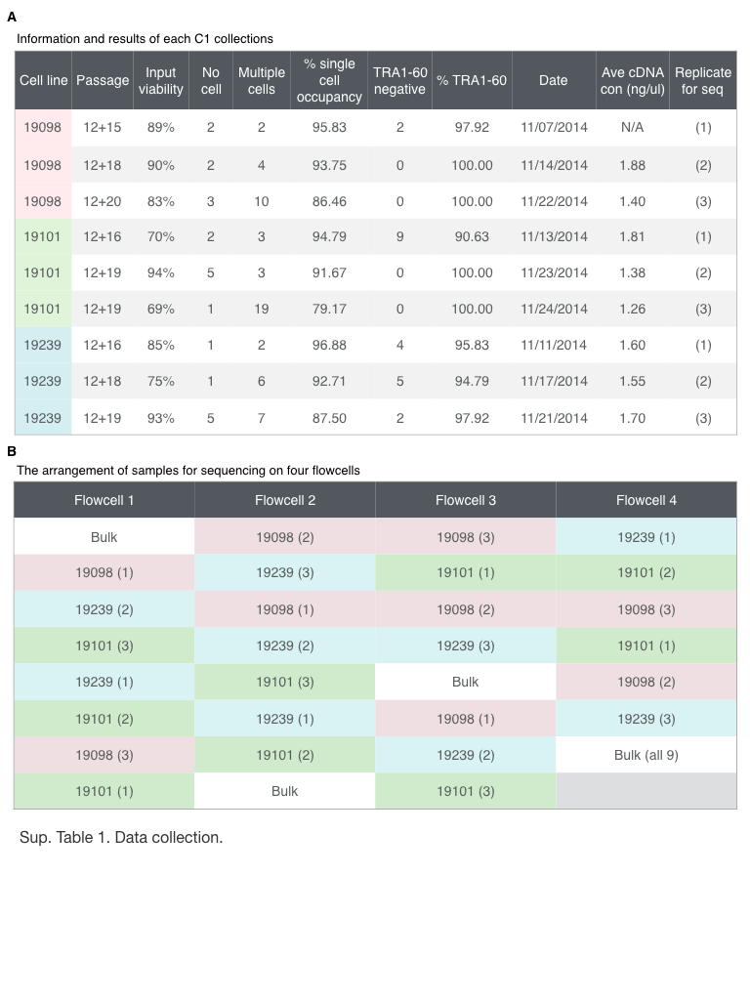

```{r chunk-options, include=FALSE}
source("chunk-options-paper.R")
```

## Tables
### Table 1. High quality single cell samples.
List of the `r nrow(anno_filter)` high quality single cell samples.

## Supplemental Figures

![**Figure `r fig_supp_qc`. Removal of low quality samples.**
Violin plots of the total read-counts of ERCC spike-in controls in (A) and the total molecule-counts in (B) in single cell samples.
The three colors represent the three individuals (NA19098 in red, NA19101 in green, and NA19239 in blue).
(C-F) Density plots of the distributions of the total mapped reads in (C), the percentage of unmapped reads in (D), the percentage of ERCC reads in (E), and the number of detected genes in (F).
The dash lines indicate the cutoffs based on the 95th percentile of the samples with no cells.](figure/Figure06.jpeg)

![**Figure `r fig_supp_lda`. Removal of samples with multiple cells.**
Scatterplots of the three groups of samples (no cell in green, single-cell in orange, and two or more cells in purple) before (A) and after (B) the linear discriminant analysis (LDA) using sample concentration of cDNA amplicons (ng/$\mu$l) and the number of detected genes.
(C and D) Similarly, LDA was performed to identify potential multi-cell samples using the read-to-molecule conversion efficiency (total molecule-counts divided by total read-counts per sample) of endogenous genes and ERCC spike-in controls.
Scatterplots of before and after the LDA in (C) and (D), respectively.
The numbers indicate the number of cells observed in each cell capture site.](figure/Figure07.jpeg)


![**Figure `r fig_supp_dropout`. The gene-specific dropout rate.**
The gene-specific dropout rate (the proportion of cells in which the gene is undetected) and its relationship with log~10~ mean expression in (A), with log~10~ variance of expression in (B), and with the CV in (C) of the cells in which the gene is expressed (cells in which at least one molecule of the given gene was detected).
Each point represents a gene, and red lines indicate the predicted values using locally weighted scatterplot smoothing (LOESS).](figure/Figure09.jpeg)

![**Figure `r fig_supp_permutation`. Permutation-based *P*-value.**
\(A\) Histogram of empirical *P*-values based on 300,000 permutations.
(B) -log~10~ empirical *P*-values are plotted against average gene expression levels.
Blue line indicates the fitted relationship between -log~10~ *P*-values and average log~2~ gene expression levels of cells that were detected as expressed, using locally weighted scatterplot smoothing (LOESS).
(C) Median of Absolute Deviation (MAD) of genes versus average gene expression levels.
Green line indicates the fitted relationship (LOESS) between the MAD values and average log~2~ gene expression levels of cells in which the gene was detected as expressed.](figure/Figure10.jpeg)

![**Figure `r fig_supp_noisygene`. Inter-individual differences in regulatory noise.**
These 5 example genes illustrate various patterns of cell-to-cell gene expression variance.
For each gene, the left panel shows the distribution of the log~2~ gene expression levels (considering only cells in which the gene is detected as expressed),
the middle panel shows the proportion of cells in which the gene is detected as expressed (dark grey) and the dropout rate (light grey) for each individual,
and the right panel shows the absolute value of adjusted CV for each individual, along with the corresponding gene-specific MAD (median of absolute deviation) value and *P*-value.
The three colors in the upper and lower panel represent the individuals (NA19098 in red, NA19101 in green, and NA19239 in blue).](figure/Figure11.jpeg)


![**Figure `r fig_supp_CV`. Coefficients of variation (CV) before and after adjusting for gene mean abundance.**
(A-C) CV plotted against average molecule counts across all cells for each individual [@Islam2014].
Grey points represent endogenous genes, and blue points represent ERCC spike-in controls.
The curves indicate the expected CV under three different scenarios.
Red curve depicts the expected CV of the endogenous genes while assuming a Poisson distribution with no over-dispersion.
Likewise, blue curve depicts the expected CVs of the ERCC spike-in controls under the Poisson assumption.
Yellow curve depicts the expected CVs of an over-dispersed Poisson distribution for which standard deviation is three times the ERCC spike-in controls.
(D-F) Adjusted CV values of each gene including all cells are plotted against log~10~ of the average molecule counts for each individual.](figure/Figure15.jpeg)

## Supplemental Table

### Table `r table_supp_collection`. Data collection.
\(A\) iPSCs were sorted using the 10-17 $\mu$m IFC plates with the staining of the pluripotency marker, TRA1-60.
Single cell occupancy is the percentage of occupied capture sites containing one single cell.
The average cDNA concentration was measured by the HT DNA high sensitivity LabChip (Caliper).
(B) The 96 single cell libraries from one C1 plate were pooled and sequenced in three HiSeq lanes.
The pooled samples were assigned across the four 8-lane flowcells.



### Table `r table_noisygene`. Genes associated with inter-individual differences in regulatory noise.
List of genes that we classified the estimates of regulatory noise as significantly different across individuals (empirical permutation *P* < 10^-4^). There are a total of 560 genes.

### Table `r table_GO`. Gene ontology analysis of the genes associated with inter-individual differences in regulatory noise.
