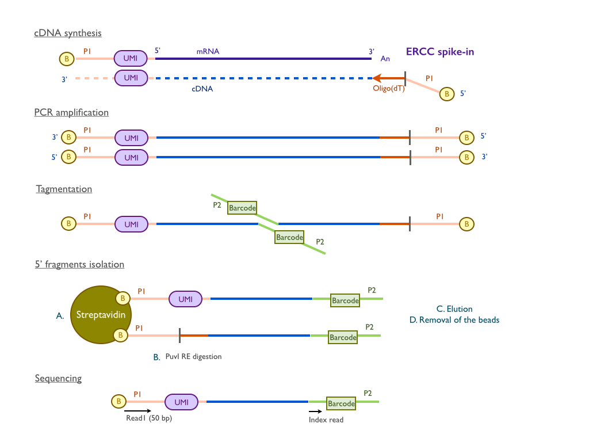
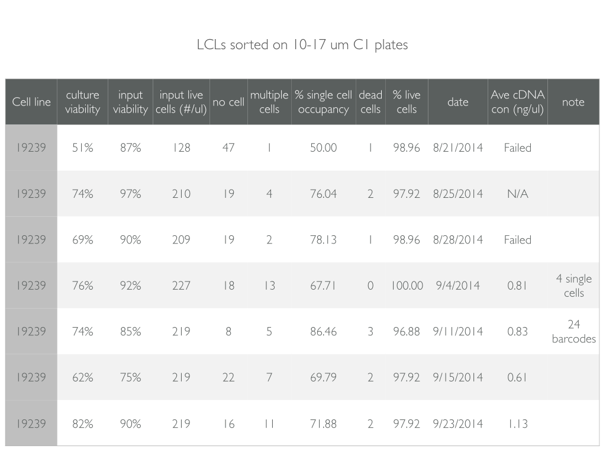
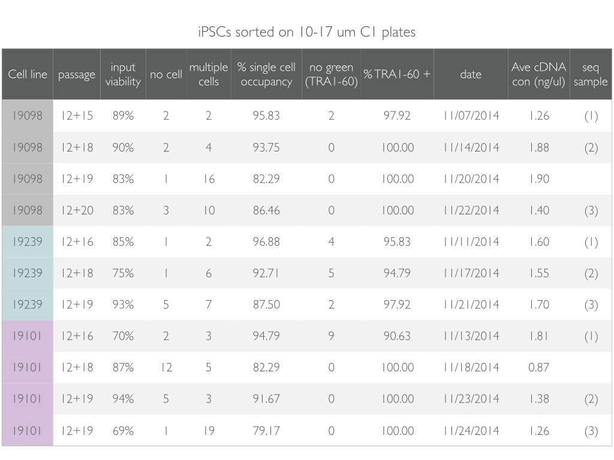
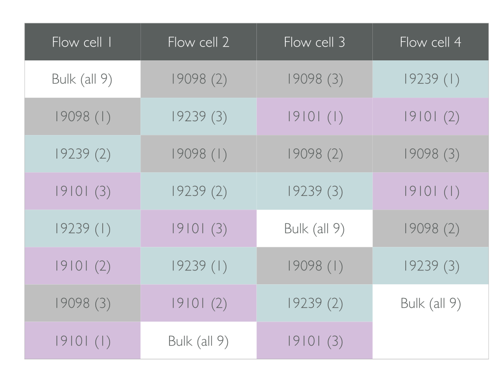

```{r chunk-options, include=FALSE}
source("chunk-options-paper.R")
```

## Materials and Methods

### Cell culture
Undifferentiated feeder-free iPSCs generated from Yoruba LCLs were grown in E8 medium (Life Tech) [chen et al](http://www.ncbi.nlm.nih.gov/pubmed/21478862?dopt=Abstract&holding=npg) on Metrigel-coated tissue culture plates with daily media feeding at 37 °C with 5% (vol/col) CO2. 
For standard maintenance, cells were splited every 3-4 days using cell release solution (0.5 mM EDTA and NaCl in PBS) at the confluence of roughly 80%. 
For the single cell suspension, iPSC were individualized by Accutase Cell Detachment Solution (BD) for 5-7 minutes at 37 °C and washed twice with E8 media immediately before each experiment. 
Cell viability and cell counts were then measured by the Automated Cell Counter (Bio-Rad) to generate resuspension at densities of 2.5 X 105 cells/mL in E8 medium for C1 cell capture.   

### Single cell capture and single cell library preparation
Single cell loading and capture was performed following the fluidigm manual "Using the C1 Single-Cell Auto Prep System to Generate mRNA from Single Cells and Libraries for Sequencing." 
Briefly, 30 ul of C1 Suspension Reagent was added to a 70-ul aliquot of ~17,500 cells. 
Five ul of this cell mix were loaded onto 10-17 um C1 Single-Cell Auto Prep IFC microfluidic chip (Fluidigm), and the chip was then processed on a C1 instrument using the cell-loading script according to the manufacturer's instructions. 
Using the standard staining script, the iPSCs were stained with StainAlive TRA-1-60 Antibody (Stemgent, PN 09-0068). 
The capture efficiency and TRA-1-60 staining were then inspected using the EVOS FL Cell Imaging System (ThermoFisher)(supplemental Table X). 

Immediately after imaging, reverse transcription and cDNA amplification were performed in the C1 system using the SMARTer PCR cDNA Synthesis kit (Clontech) and the Advantage 2 PCR kit (Clontech) according to the instructions in the Fluidigm user manual with minor changes to incorporate UMI labeling [Islam](http://www.nature.com/nmeth/journal/v11/n2/abs/nmeth.2772.html). 
Specifically, the reverse transcription primer and the 1:50,000 Ambion® ERCC Spike-In Mix1 (Life Tech) were added to the lysis buffer, and the template-switching oligos which contain the UMI (5-bp random sequence) were included in the reverse transcription mix. 
When the run finished, full-length, amplified, single-cell cDNA libraries were harvested in a total of approximately 12 ul C1 Harvesting Reagents and quantified using DNA High Sensitivity LabChip (Caliper). 
A bulk sample, a 40 ul aliquot of ~10,000 cells, was collected together with each C1 chip using the same reaction mixes.

For sequencing library preparation, tagmentation and isolation of 5' fragments were performed according to the UMI protocol [Islam].
Instead of using commercial available Tn5 transposase, Tn5 protein stock was freshly purified in house using the IMPACT system (pTXB1, NEB) following the protocol previously described [Picelli](http://genome.cshlp.org/content/24/12/2033.long). 
The activity of Tn5 was tested and shown to be comparable with the EZ-Tn5-Transposase (Epicentre). 
Importantly, all the libraries in this study were generated using the same batch of Tn5 protein purification. 
For each of the bulk samples, two libraries were generated using two different indices in order to get sufficient material. 
All of the 18 bulk libraries were then pooled and labelled as the "bulk" for sequencing.

### Illumina high-throughput sequencing
Single-cell RNA-seq libraries generated from 96 individual cells (namely, one C1 microfluidic prep) were pooled and then sequenced in three lanes on an Illumina Hiseq 2500 instrument using the PCR primer (C1-P1-PCR-2) as the read 1 primer and the Tn5 adapter (C1-Tn5-U) as the index read primer [Islam]. 
Libraries, both from bulk and single cell samples, were assigned to lanes at random on the flowcells (Supplemental Table X). 
Single-end reads of 100 bp were generated along with 8-bp index reads corresponding to the cell-specific barcodes. 

### Read mapping and quality control
1. quality trim
2. subread 
3. umi tool

### Normalization 
1. linear shift
2. mix effect model


### Description of technologies used

1. UMIs (unique molecular identifiers) were added to each RNA transcript during the reverse transcript step, which provides the power to calculate the absolute numbers of the transcripts. 5 random nucleotides (NNNNN) were used as UMIs. Therefore, there are 1024 different UMIs.

2. ERCC spike-ins were added during the cell lysis step as the control.

3. C1 fluidigm system is used to collect single cell 

 

### Preparation of single LCLs

* cell line: 19239
* sequencing data:
  1. twocell: two cells were sequenced in one rapid lane (index failed)
  2. 4 individual cells: each sequenced in 1 full flowcell lane, 2 made by in-house Tn2 and the other 2 by Epicentre
  3. 96 cells: cells collected by 1 C1 plate. Due to financial limitation, only 24 indices were used. Each pool of 24 libraries were sequenced in 1 full flowcell lane. These and the 4 individual cells were sequenced on the same flowcell.

  
  
### Preparation of single iPSCs

* cell line: 19239, 19101, 19098
* number of replicates: 3, each collected using different passages of cells
* bulk vs single cell: each C1 plate has a bulk sample collected at the same time using the same chemicals freshly prepared each time. For the bulk, 2 libraries using 2 different indices were generated from each bulk sample (total 2*9=18). All the bulk samples were pooled as the "bulk" for sequencing. For single cell, the 96 libraries from the same C1 plates were pooled and sequenced.
* sequencing: SE 100+8. total 31 lanes are required. therefore, 4 full flowcells were used. "bulk" sample was sequenced in 1 lane of all 4 flowcells. samples were balanced as much as possible. 
* goals: ~ 3 millions good reads per cell and average 200,000 molecules per cell 




